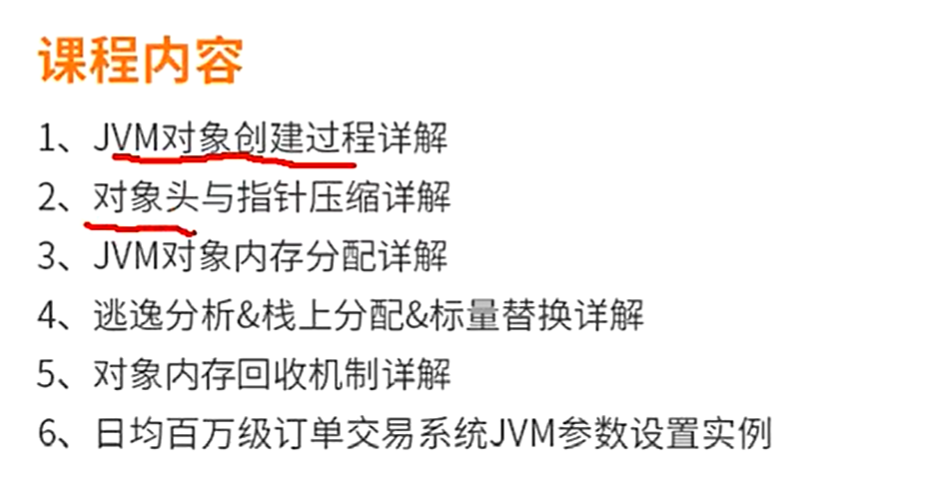
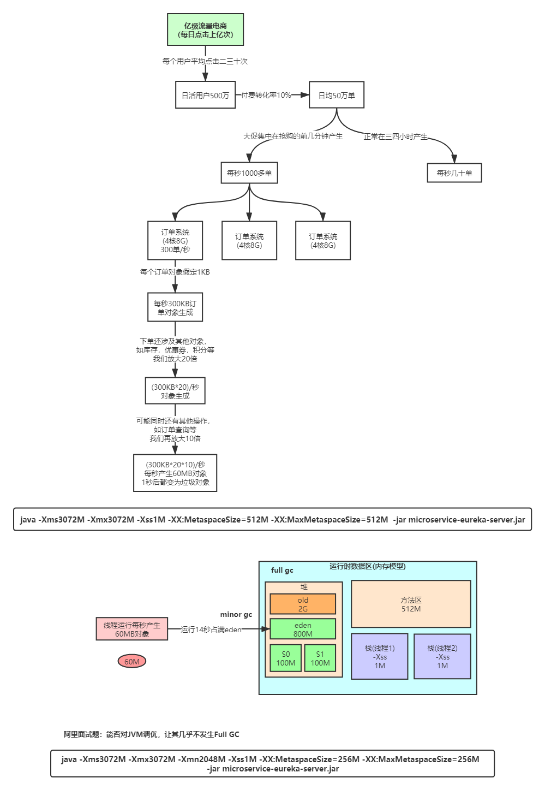
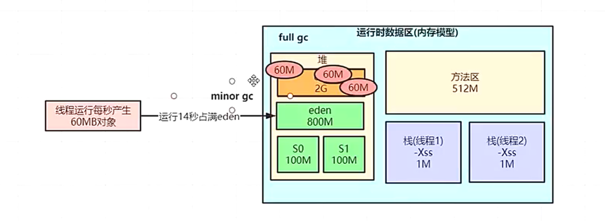
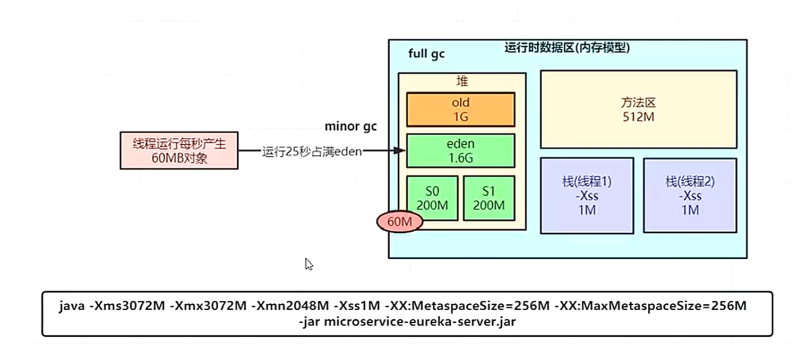

 
**日均百万级订单交易系统如何设置JVM参数**




**根据物理机分配：如果4核8G:操作系统2-3G,留个JVM的空间为4-5G,给堆3G，元空间512M,栈1M，这其实并不合理**
这样的分配的话，14s后Eden区就会沾满（第13s的时候触发minor gc 同时触发stw，最后疫苗产生的对象会被GC root引用，无法不会回收，会移到s0区域，但是会直接放到老年代，由对象动态年龄判断）因此会频繁full GC，所以要把年轻代放大 
优化
```java -Xms3072M -Xmx3072M -Xmn2048M -Xss1M -XX:MetaspaceSize=256M -XX:MaxMetaspaceSize=256M -jar microservice-eureka-server.jar
```

但是峰值时可能存在问题，700单/s

结论：通过上面这些内容介绍，大家应该对JVM优化有些概念了，就是尽可能让对象都在新生代里分配和回收，尽量别让太多对象频繁进入老年代，避免频繁对老年代进行垃圾回收，同时给系统充足的内存大小，避免新生代频繁的进行垃圾回收。

1、一定要设置元空间大小，否则频繁full GC