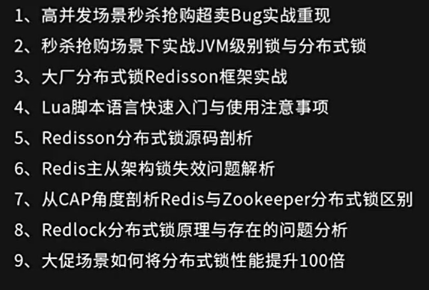
压测软件Jmeter
# 减库存代码示例
## 写法1：存在的问题
**synchronized只能保证单机环境下多线程并发安全，分布式环境下无法保证**
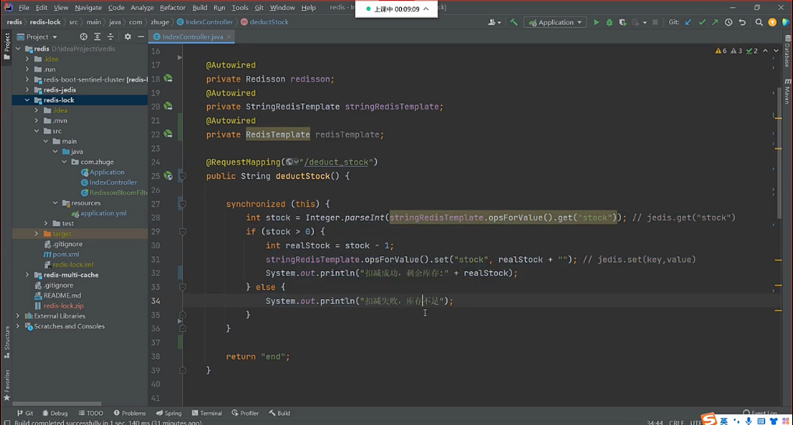

## 写法二，基于Redis的setnx命令
**存在的问题：执行业务期间，发生异常/或者宕机了，还未走到Delete方法，无法释放锁，相当于死锁，所有请求都会阻塞**
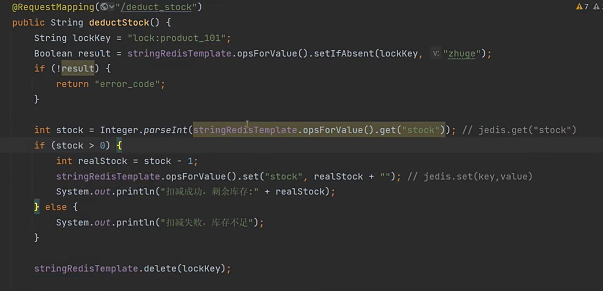
或者
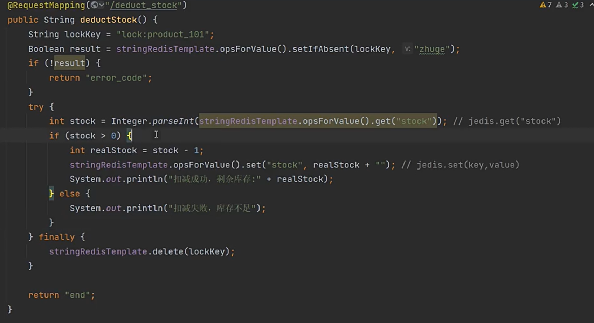


## 写法三，先获取锁，再设置锁过期时间
存在的问题：
**获取锁和设置锁的过期时间是两个操作或者说不是原子操作，可能还没有执行到设置锁过期时间的这一行代码，服务器宕机了，仍然会发生死锁**

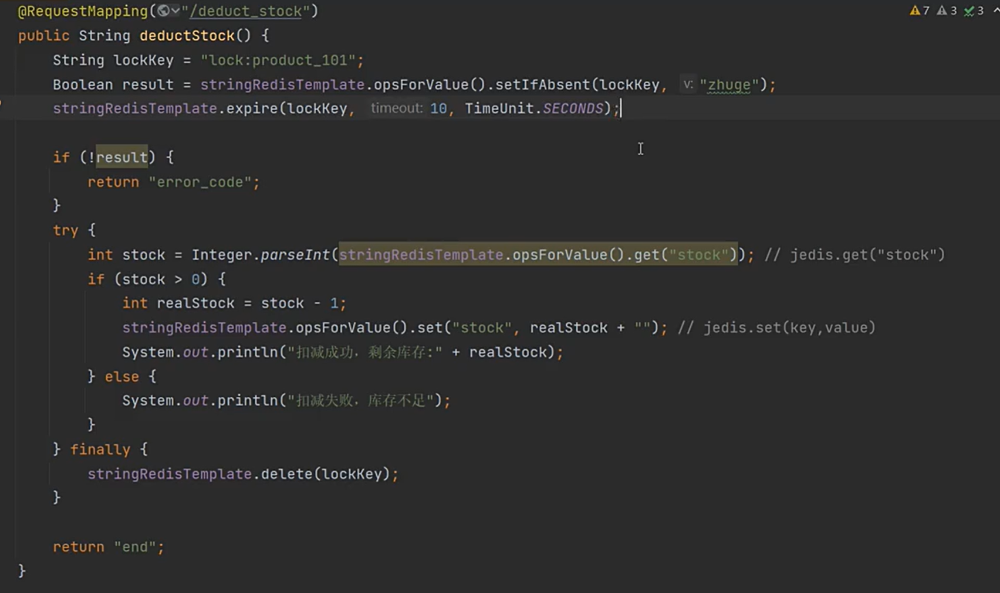

## 写法四。获取锁和设置过期时间用原子操作完成
**存在的问题：如果锁的有效时间设置小了，可能线程1还没有执行完业务代码，而它的锁已经失效，高并发场景下，就会有别的线程2加锁成功，从而执行业务代码，而线程1执行完业务代码，如果此时线程2还没有执行完，线程1就会将线程2刚刚加的锁删除掉，然后别的线程就又可以进行加锁，从而引发超卖问题**
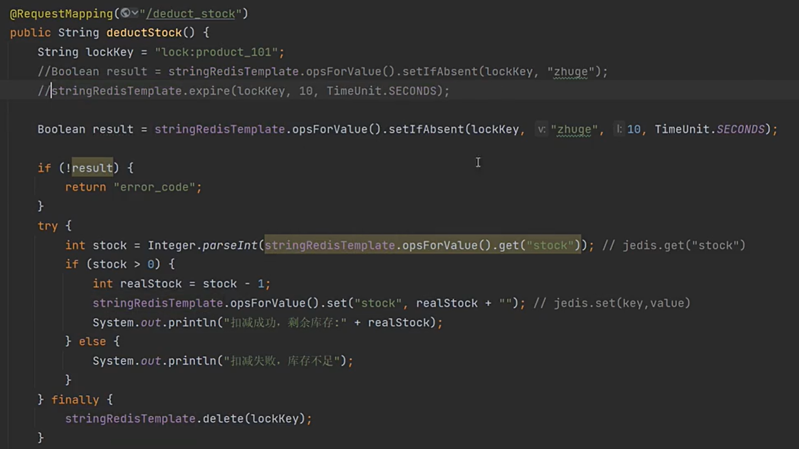

## 写法五： 每个线程在加锁时设置自己的唯一标识，在释放锁时匹配唯一标识，只能删除自己的锁
**存在的问题：高并发场景下，如果释放锁之前发生卡顿且此时锁刚好过期，那么还是会发生锁失效，其他线程就又可以加锁了，依然可能会存在并发问题**
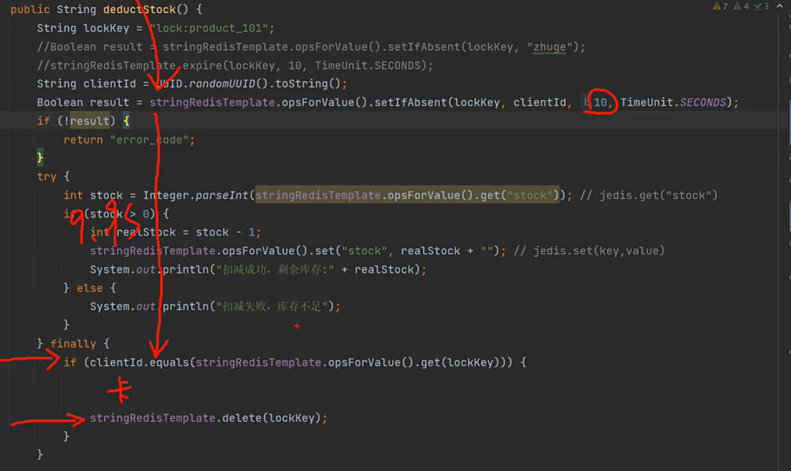


**综上，为了解决分布式锁问题，应用Redisson**
```java
@RequestMapping("/deduct_stock")
public String deductStock() {
	String lockKey = "lock:product_101";
	//Boolean result = stringRedisTemplate.opsForValue().setIfAbsent(lockKey, "zhuge");
	//stringRedisTemplate.expire(lockKey, 10, TimeUnit.SECONDS);
	/*String clientId = UUID.randomUUID().toString();
	Boolean result = stringRedisTemplate.opsForValue().setIfAbsent(lockKey, clientId, 30, TimeUnit.SECONDS); //jedis.setnx(k,v)
	if (!result) {
		return "error_code";
	}*/
	//获取锁对象
	RLock redissonLock = redisson.getLock(lockKey);
	//加分布式锁
	redissonLock.lock();  //  .setIfAbsent(lockKey, clientId, 30, TimeUnit.SECONDS);
	try {
		int stock = Integer.parseInt(stringRedisTemplate.opsForValue().get("stock")); // jedis.get("stock")
		if (stock > 0) {
			int realStock = stock - 1;
			stringRedisTemplate.opsForValue().set("stock", realStock + ""); // jedis.set(key,value)
			System.out.println("扣减成功，剩余库存:" + realStock);
		} else {
			System.out.println("扣减失败，库存不足");
		}
	} finally {
		/*if (clientId.equals(stringRedisTemplate.opsForValue().get(lockKey))) {
			stringRedisTemplate.delete(lockKey);
		}*/
		//解锁
		redissonLock.unlock();
	}


	return "end";
}

```
Redisson源码
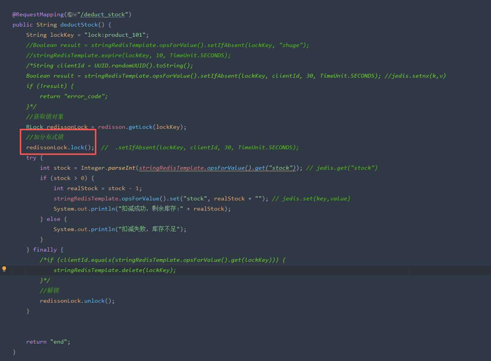
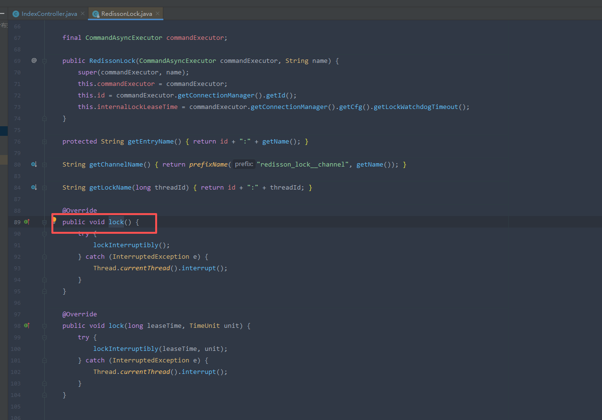
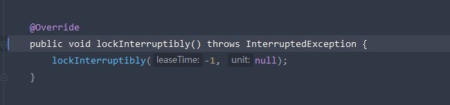
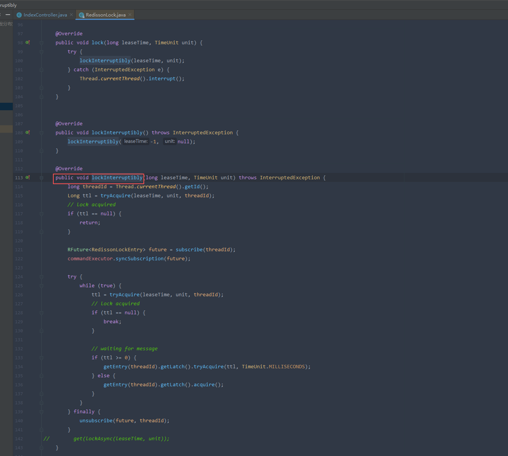
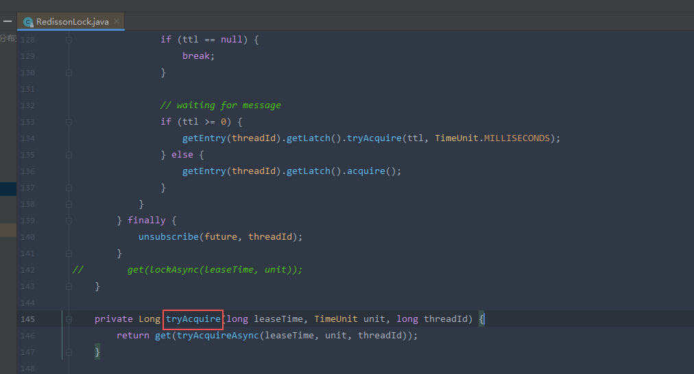
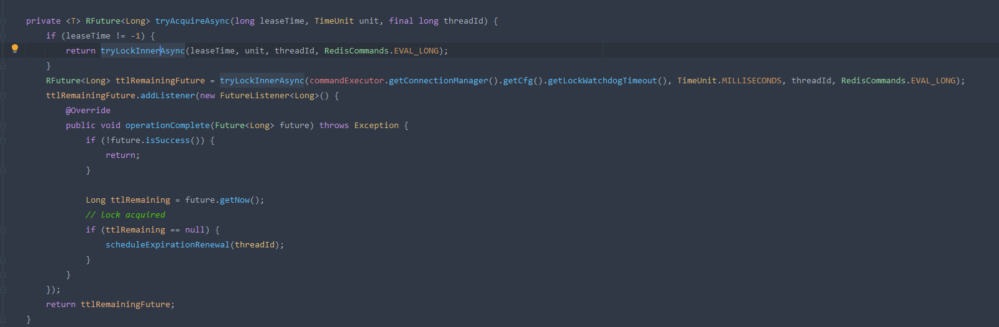
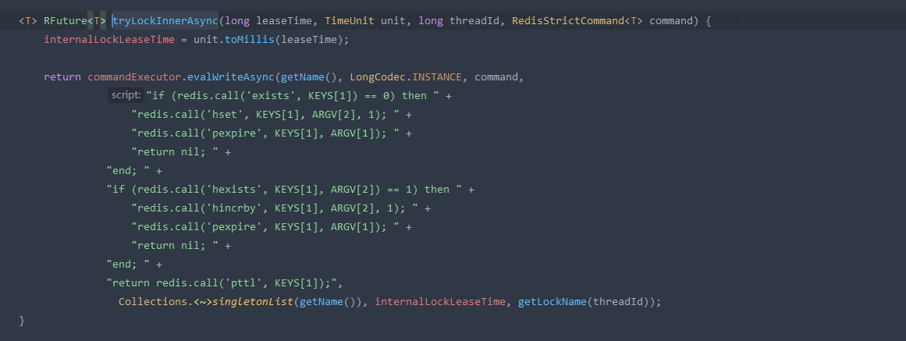
加锁核心逻辑为
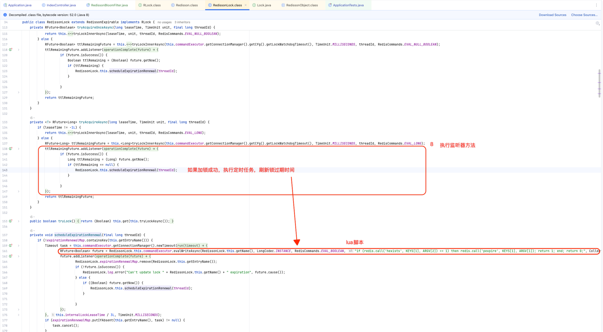
```java
<T> RFuture<T> tryLockInnerAsync(long leaseTime, TimeUnit unit, long threadId, RedisStrictCommand<T> command) {
    this.internalLockLeaseTime = unit.toMillis(leaseTime);
    return this.commandExecutor.evalWriteAsync(this.getName(), LongCodec.INSTANCE, command, "/lua脚本/", 
    Collections.singletonList(this.getName()), new Object[]{this.internalLockLeaseTime, this.getLockName(threadId)});
}
// lua脚本
if (redis.call('exists', KEYS[1]) == 0) // KEYS[1] 表示 this.getName()，即lockKey，如果redis中没有这个key，则可以加锁
    then redis.call('hset', KEYS[1], ARGV[2], 1); // 使用Hash表存field：this.getLockName(threadId)，value：1，lockKey指向这个Hash
    redis.call('pexpire', KEYS[1], ARGV[1]); // 设置过期时间30s
    return nil; // 加锁成功，返回NULL（Java）
end; 
if (redis.call('hexists', KEYS[1], ARGV[2]) == 1)  // 在线程A中调用的线程B也请求相同的锁，即可重入锁
    then redis.call('hincrby', KEYS[1], ARGV[2], 1); // 为了防止死锁，基于线程A的值加1，即B也获得了这把锁，继续执行
    redis.call('pexpire', KEYS[1], ARGV[1]); // 继续延长锁的时间为30s
    return nil; // 加锁成功，返回NULL（Java）
end; 
   return redis.call('pttl', KEYS[1]); // 其他线程请求锁，只返回当前持有锁的剩余过期时间
```

锁续命逻辑
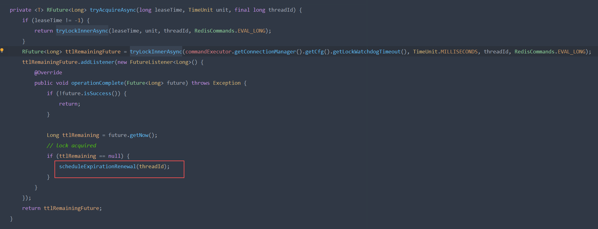
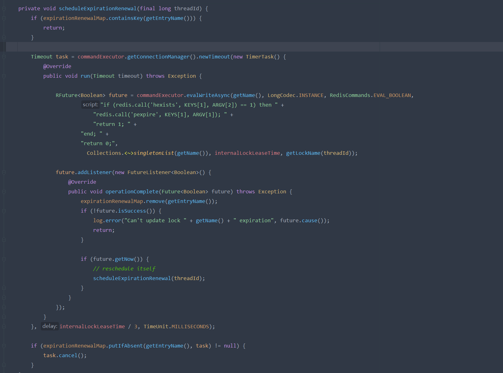
```java
// lua脚本
if (redis.call('hexists', KEYS[1], ARGV[2]) == 1) // 如果当前线程还持有锁，则重新设置过期时间为30s
    then redis.call('pexpire', KEYS[1], ARGV[1]); // 设置过期时间为30s
    return 1; // 返回true，表示成功延长锁过期时间
end; 
    return 0; // 返回false，表示当前线程未拥有锁/锁已经释放，无法延长

```
### 其他线程加锁逻辑
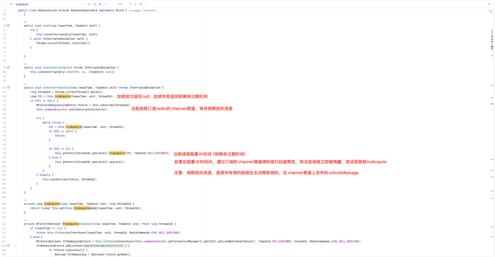
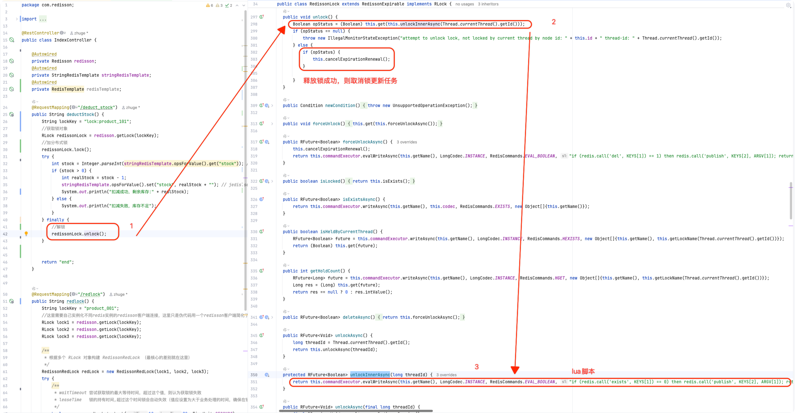

核心代码
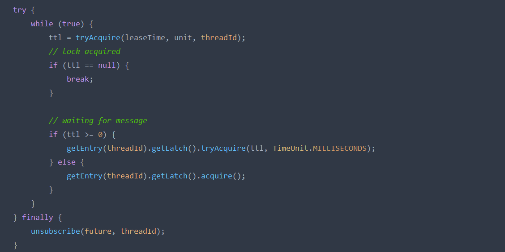
getEntry(threadId).getLatch().tryAcquire(ttl, TimeUnit.MILLISECONDS);
获取信号许可阻塞，此阻塞会让出cpu，唤醒是用的Redis的发布订阅

解锁逻辑
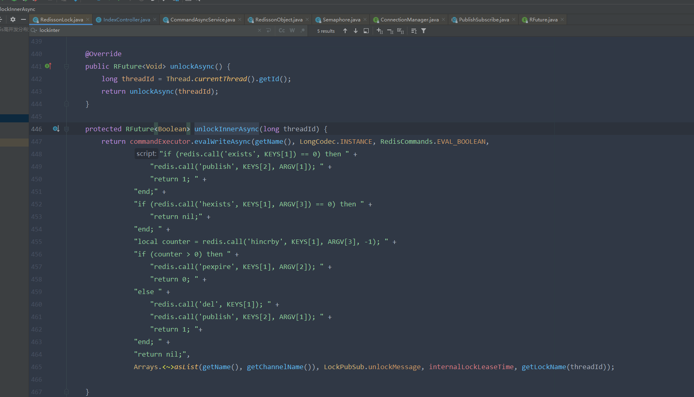