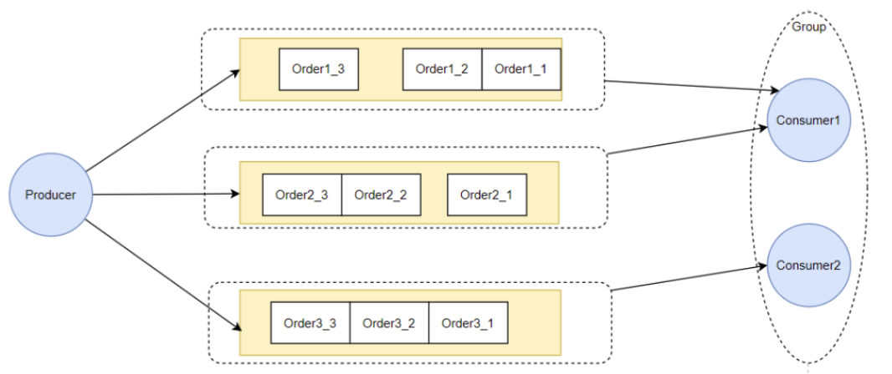
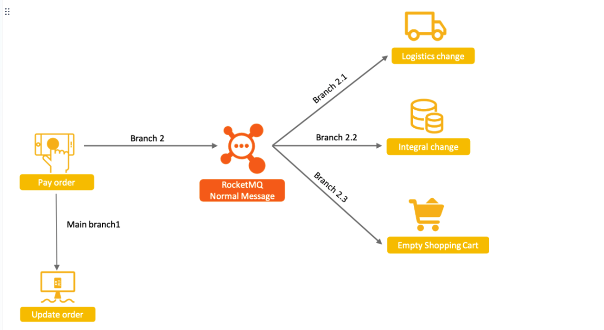
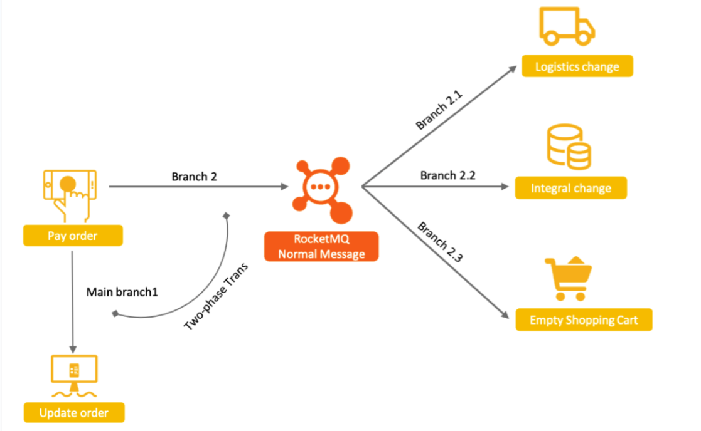
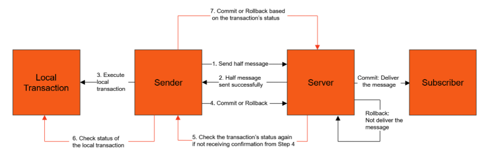
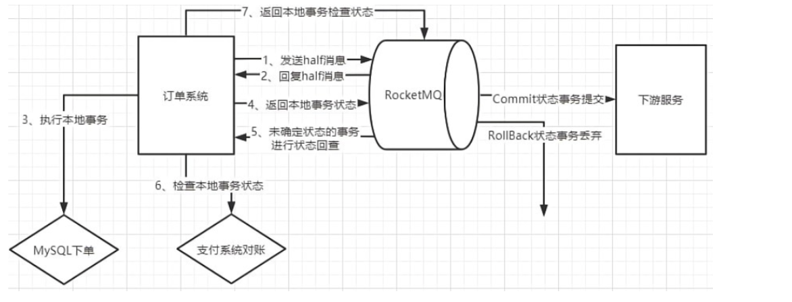
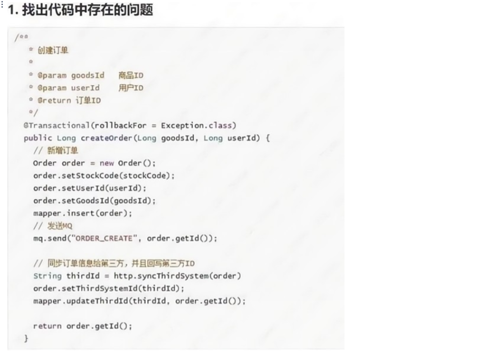

## 5.顺序消息机制
**应用场景：**
每一个订单有从下单、锁库存、支付、下物流等几个业务步骤。每个业务步骤都由一个消息生产者通知给下游服务。如何保证对每个订单的业务处理顺序不乱？
**示例代码：**
生产者核心代码：通过MessageSelector，将orderId相同的消息，都转发到同一个MessageQueue中。
```
for (int i = 0; i < 10; i++) {
	int orderId = i;
	for(int j = 0 ; j <= 5 ; j ++){
		Message msg =
				new Message("OrderTopicTest", "order_"+orderId, "KEY" + orderId,
						("order_"+orderId+" step " + j).getBytes(RemotingHelper.DEFAULT_CHARSET));
		SendResult sendResult = producer.send(msg, new MessageQueueSelector() {
			@Override
			public MessageQueue select(List<MessageQueue> mqs, Message msg, Object arg) {
				Integer id = (Integer) arg;
				int index = id % mqs.size();
				return mqs.get(index);
			}
		}, orderId);
		System.out.printf("%s%n", sendResult);
	}
}
```
消费者核心代码：注入一个MessageListenerOrderly实现。
```
consumer.registerMessageListener(new MessageListenerOrderly() {
	@Override
	public ConsumeOrderlyStatus consumeMessage(List<MessageExt> msgs, ConsumeOrderlyContext context) {
		context.setAutoCommit(true);
		for(MessageExt msg:msgs){
			System.out.println("收到消息内容 "+new String(msg.getBody()));
		}
		return ConsumeOrderlyStatus.SUCCESS;
	}
});
```
**实现思路：**
RocketMQ实现消息顺序消费，是需要生产者和消费者配合才能实现的。


1、生产者只有将一批有顺序要求的消息，放到同一个MesasgeQueue上，通过MessageQueue的FIFO特性保证这一批消息的顺序。<br>
​ 如果不指定MessageSelector对象，那么生产者会采用轮询的方式将多条消息依次发送到不同的MessageQueue上。<br>
​ 2、消费者需要实现MessageListenerOrderly接口，实际上在服务端，处理MessageListenerOrderly时，会给一个MessageQueue加锁，拿到MessageQueue上所有的消息，然后再去读取下一个MessageQueue的消息。<br>

**注意点：**
​ 1、理解局部有序与全局有序。大部分业务场景下，我们需要的其实是局部有序。如果要保持全局有序，那就只保留一个MessageQueue。性能显然非常低。<br>
​ 2、生产者端尽可能将有序消息打散到不同的MessageQueue上，避免过于集中导致数据热点竞争。<br>
​ 3、消费者端只进行有限次数的重试。如果一条消息处理失败，RocketMQ会将后续消息阻塞住，让消费者进行重试。但是，如果消费者一直处理失败，超过最大重试次数，那么RocketMQ就会跳过这一条消息，处理后面的消息，这会造成消息乱序。<br>
​ 4、消费者端如果确实处理逻辑中出现问题，不建议抛出异常，可以返回ConsumeOrderlyStatus.SUSPEND_CURRENT_QUEUE_A_MOMENT作为替代。<br>
## 8、事务消息
**应用场景：**
事务消息是RocketMQ非常有特色的一个高级功能。他的基础诉求是通过RocketMQ的事务机制，来保证上下游的数据一致性。<br>
以电商为例，用户支付订单这一核心操作的同时会涉及到下游物流发货、积分变更、购物车状态清空等多个子系统的变更。这种场景，非常适合使用RocketMQ的解耦功能来进行串联。


考虑到事务的安全性，即要保证相关联的这几个业务一定是同时成功或者同时失败的。如果要将四个服务一起作为一个分布式事务来控制，可以做到，但是会非常麻烦。而使用RocketMQ在中间串联了之后，事情可以得到一定程度的简化。由于RocketMQ与消费者端有失败重试机制，所以，只要消息成功发送到RocketMQ了，那么可以认为Branch2.1，Branch2.2，Branch2.3这几个分支步骤，是可以保证最终的数据一致性的。这样，一个复杂的分布式事务问题，就变成了MinBranch1和Branch2两个步骤的分布式事务问题。<br>
然后，在此基础上，RocketMQ提出了事务消息机制，采用两阶段提交的思路，保证Main Branch1和Branch2之间的事务一致性。


具体的实现思路是这样的：


1. 生产者将消息发送至Apache RocketMQ服务端。
2. Apache RocketMQ服务端将消息持久化成功之后，向生产者返回Ack确认消息已经发送成功，此时消息被标记为"暂不能投递"，这种状态下的消息即为半事务消息。
3. 生产者开始执行本地事务逻辑。
4. 生产者根据本地事务执行结果向服务端提交二次确认结果（Commit或是Rollback），服务端收到确认结果后处理逻辑如下：
	- 二次确认结果为Commit：服务端将半事务消息标记为可投递，并投递给消费者。
	- 二次确认结果为Rollback：服务端将回滚事务，不会将半事务消息投递给消费者。
5. 在断网或者是生产者应用重启的特殊情况下，若服务端未收到发送者提交的二次确认结果，或服务端收到的二次确认结果为Unknown未知状态，经过固定时间后，服务端将对消息生产者即生产者集群中任一生产者实例发起消息回查。
6. 生产者收到消息回查后，需要检查对应消息的本地事务执行的最终结果。
7. 生产者根据检查到的本地事务的最终状态再次提交二次确认，服务端仍按照步骤4对半事务消息进行处理。
**示例代码：** 参见 org.apache.rocketmq.example.transaction.TransactionProducer

实现时的重点是使用RocketMQ提供的TransactionMQProducer事务生产者，在TransactionMQProducer中注入一个TransactionListener事务监听器来执行本地事务，以及后续对本地事务的检查。
**注意点：**
1. 半消息是对消费者不可见的一种消息。实际上，RocketMQ的做法是将消息转到了一个系统Topic，RMQ_SYS_TRANS_HALF_TOPIC。
2. 事务消息中，本地事务回查次数通过参数transactionCheckMax设定，默认15次。本地事务回查的间隔通过参数transactionCheckInterval设定，默认60秒。超过回查次数后，消息将会被丢弃。
3. 其实，了解了事务消息的机制后，在具体执行时，可以对事务流程进行适当的调整。


4. 如果你还是感觉不到RocketMQ事务消息机制的作用，那么可以看看下面这个面试题：



## 9、ACL权限控制机制


