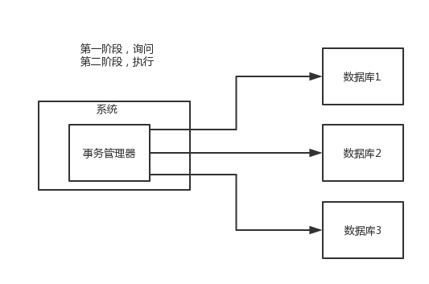
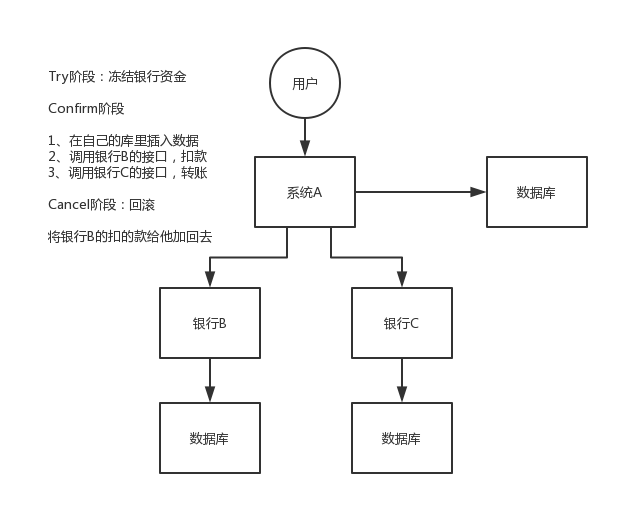
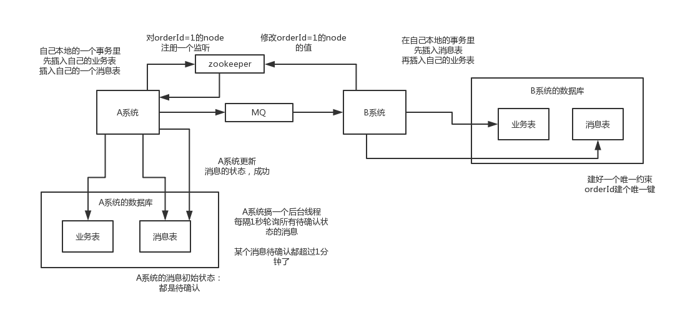
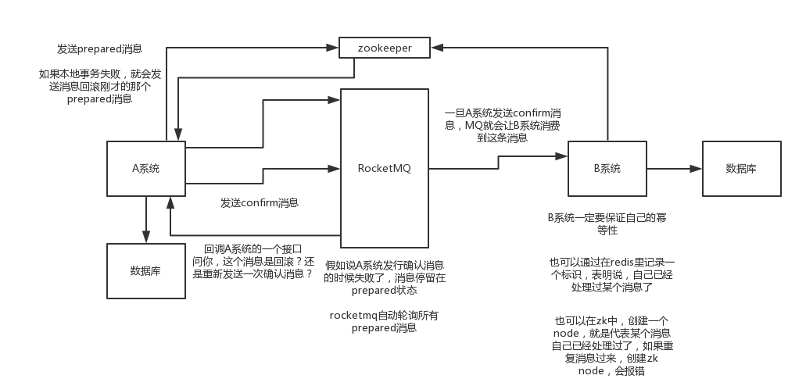
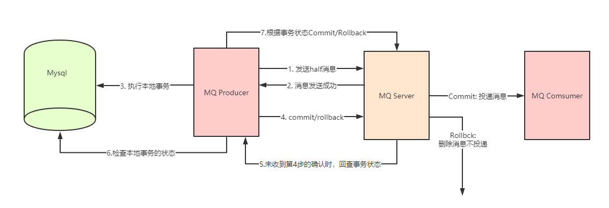
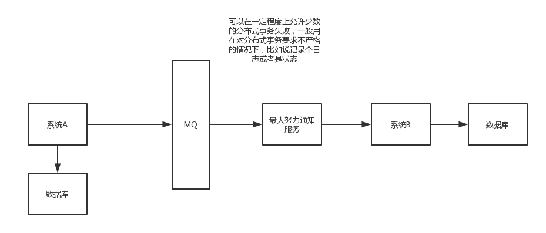
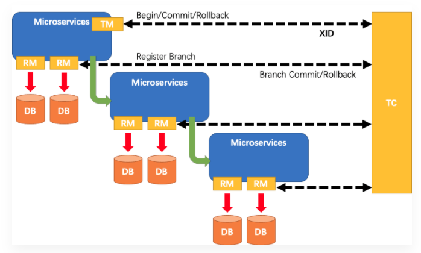
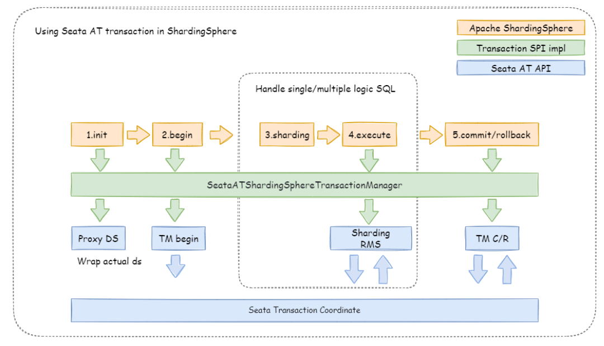

**分布式事务理论：** https://www.processon.com/view/link/61cd52fb0e3e7441570801ab

# 1、两阶段提交方案/XA方案
也叫做两阶段提交事务方案，这个举个例子，比如说咱们公司里经常tb是吧（就是团建），然后一般会有个tb主席（就是负责组织团建的那个人）。
tb，team building，团建
第一个阶段，一般tb主席会提前一周问一下团队里的每个人，说，大家伙，下周六我们去滑雪+烧烤，去吗？这个时候tb主席开始等待每个人的回答，如果所有人都说ok，那么就可以决定一起去这次tb。如果这个阶段里，任何一个人回答说，我有事不去了，那么tb主席就会取消这次活动。
第二个阶段，那下周六大家就一起去滑雪+烧烤了

所以这个就是所谓的XA事务，两阶段提交，有一个事务管理器的概念，负责协调多个数据库（资源管理器）的事务，事务管理器先问问各个数据库你准备好了吗？如果每个数据库都回复ok，那么就正式提交事务，在各个数据库上执行操作；如果任何一个数据库回答不ok，那么就回滚事务。


这种分布式事务方案，比较适合单块应用里，跨多个库的分布式事务，而且因为严重依赖于数据库层面来搞定复杂的事务，效率很低，绝对不适合高并发的场景。如果要玩儿，那么基于spring + JTA就可以搞定，

# 2、TCC方案
TCC的全程是：Try、Confirm、Cancel。
这个其实是用到了补偿的概念，分为了三个阶段：

1）Try阶段：这个阶段说的是对各个服务的资源做检测以及对资源进行锁定或者预留
2）Confirm阶段：这个阶段说的是在各个服务中执行实际的操作
3）Cancel阶段：如果任何一个服务的业务方法执行出错，那么这里就需要进行补偿，就是执行已经执行成功的业务逻辑的回滚操作



这种方案说实话几乎很少用人使用，我们用的也比较少，但是也有使用的场景。因为这个事务回滚实际上是严重依赖于你自己写代码来回滚和补偿了，会造成补偿代码巨大，非常之恶心。

比如说我们，一般来说跟钱相关的，跟钱打交道的，支付、交易相关的场景，我们会用TCC，严格严格保证分布式事务要么全部成功，要么全部自动回滚，严格保证资金的正确性，在资金上出现问题

比较适合的场景：这个就是除非你是真的一致性要求太高，是你系统中核心之核心的场景，比如常见的就是资金类的场景，那你可以用TCC方案了，自己编写大量的业务逻辑，自己判断一个事务中的各个环节是否ok，不ok就执行补偿/回滚代码。

而且最好是你的各个业务执行的时间都比较短。

但是说实话，一般尽量别这么搞，自己手写回滚逻辑，或者是补偿逻辑，实在太恶心了，那个业务代码很难维护。

# 3、本地消息表
国外的ebay搞出来的这么一套思想

- 1）A系统在自己本地一个事务里操作同时，插入一条数据到消息表
- 2）接着A系统将这个消息发送到MQ中去
- 3）B系统接收到消息之后，在一个事务里，往自己本地消息表里插入一条数据，同时执行其他的业务操作，如果这个消息已经被处理过了，那么此时这个事务会回滚，这样保证不会重复处理消息
- 4）B系统执行成功之后，就会更新自己本地消息表的状态以及A系统消息表的状态
- 5）如果B系统处理失败了，那么就不会更新消息表状态，那么此时A系统会定时扫描自己的消息表，如果有没处理的消息，会再次发送到MQ中去，让B再次处理
- 6）这个方案保证了最终一致性，哪怕B事务失败了，但是A会不断重发消息，直到B那边成功为止

zookeeper可以换成接口调用，如果B系统执行成功或者失败可以调用接口通知A系统
**缺点：这个方案说实话最大的问题就在于严重依赖于数据库的消息表来管理事务**


# 4、可靠消息最终一致性方案
这个的意思，就是干脆不要用本地的消息表了，直接基于MQ来实现事务。比如阿里的RocketMQ就支持消息事务。

1）A系统先发送一个prepared消息到mq，如果这个prepared消息发送失败那么就直接取消操作别执行了
2）如果这个消息发送成功过了，那么接着执行本地事务，如果成功就告诉mq发送确认消息，如果失败就告诉mq回滚消息
3）如果发送了确认消息，那么此时B系统会接收到确认消息，然后执行本地的事务
4）mq会自动定时轮询所有prepared消息回调你的接口，问你，这个消息是不是本地事务处理失败了，所有没发送确认消息？那是继续重试还是回滚？一般来说这里你就可以查下数据库看之前本地事务是否执行，如果回滚了，那么这里也回滚吧。这个就是避免可能本地事务执行成功了，别确认消息发送失败了。
5）这个方案里，要是系统B的事务失败了咋办？重试咯，自动不断重试直到成功，如果实在是不行，要么就是针对重要的资金类业务进行回滚，比如B系统本地回滚后，想办法通知系统A也回滚；或者是发送报警由人工来手工回滚和补偿



注意可靠消息：RocketMQ可以进行持久化
## RocketMQ实现细节
### Half Message，半消息：
暂时不能被 `Consumer`消费的消息。`Producer`已经把消息发送到 `Broker`端，但是此消息的状态被标记为不能投递，处于这种状态下的消息称为半消息。事实上，该状态下的消息会被放在一个叫做 `RMQ_SYS_TRANS_HALF_TOPIC`的主题下。
 当 `Producer`端对它二次确认后，也就是 `Commit`之后，`Consumer`端才可以消费到；那么如果是`Rollback`，该消息则会被删除，永远不会被消费到。
 
### 事务状态回查
我们想，可能会因为网络原因、应用问题等，导致`Producer`端一直没有对这个半消息进行确认，那么这时候 `Broker`服务器会定时扫描这些半消息，主动找`Producer`端查询该消息的状态。
当然，什么时候去扫描，包含扫描几次，我们都可以配置，在后文我们再细说。
简而言之，`RocketMQ`事务消息的实现原理就是基于两阶段提交和事务状态回查，来决定消息最终是提交还是回滚的

  如果发送事务消息，在这里我们的创建的实例必须是 `TransactionMQProducer`
  `OrderTransactionListener`，它负责执行本地事务和事务状态回查


RocketMQ事务消息设计则主要是为了解决Producer端的消息发送与本地事务执行的原子性问题，RocketMQ的设计中broker与producer端的双向通信能力，使得broker天生可以作为一个事务协调者存在；而RocketMQ本身提供的存储机制为事务消息提供了持久化能力；RocketMQ的高可用机制以及可靠消息设计则为事务消息在系统发生异常时依然能够保证达成事务的最终一致性。

在RocketMQ 4.3后实现了完整的事务消息，实际上其实是对本地消息表的一个封装，将本地消息表移动到了MQ内部，解决Producer端的消息发送与本地事务执行的原子性问题。


执行流程如下 ：

为方便理解我们以注册送优惠券的例子来描述整个流程。

Producer即MQ发送方，本例中是用户服务，负责新增用户。MQ订阅方即消息消费方，本例中是优惠券服务，负责新增优惠券。

1）Producer发送事务消息
Producer（MQ发送方）发送事务消息至MQ Server，MQ Server将消息状态标记为Prepared（预览状态），注意此时这条消息消费者（MQ订阅方）是无法消费到的。

2）MQ Server回应消息发送成功
MQ Server接收到Producer发送给的消息则回应发送成功表示MQ已接收到消息。

3）Producer执行本地事务
Producer端执行业务代码逻辑，通过本地数据库事务控制。
本例中，Producer执行添加用户操作。

4）消息投递
若Producer本地事务执行成功则自动向MQ Server发送commit消息，MQ Server接收到commit消息后将“增加优惠券消息”状态标记为可消费，此时MQ订阅方（优惠券服务）即正常消费消息；
若Producer 本地事务执行失败则自动向MQ Server发送rollback消息，MQ Server接收到rollback消息后将删除“增加优惠券消息”。
MQ订阅方（优惠券服务）消费消息，消费成功则向MQ回应ack，否则将重复接收消息。这里ack默认自动回应，即程序执行正常则自动回应ack。

5）事务回查
如果执行Producer端本地事务过程中，执行端挂掉，或者超时，MQ Server将会不停的询问同组的其他Producer来获取事务执行状态，这个过程叫事务回查。MQ Server会根据事务回查结果来决定是否投递消息。

以上主干流程已由RocketMQ实现，对用户则来说，用户需要分别实现本地事务执行以及本地事务回查方法，因此只需关注本地事务的执行状态即可。

RocketMQ提供RocketMQLocalTransactionListener接口 ：
```java
public interface RocketMQLocalTransactionListener {
 /** 发送prepare消息成功此方法被回调，该方法用于执行本地事务 @param msg 回传的消息，利用transactionId即可获取到该消息的唯一Id @param arg 调用send方法时传递的参数，当send时候若有额外的参数可以传递到send方法中，这里能获取到 @return 返回事务状态，COMMIT ：提交 ROLLBACK ：回滚 UNKNOW ：回调 */ RocketMQLocalTransactionState executeLocalTransaction（Message msg，Object arg）； /** @param msg 通过获取transactionId来判断这条消息的本地事务执行状态 @return 返回事务状态，COMMIT ：提交 ROLLBACK ：回滚 UNKNOW ：回调 */ 
 RocketMQLocalTransactionState checkLocalTransaction（Message msg）； 
}
```

# 5、最大努力通知方案
1）系统A本地事务执行完之后，发送个消息到MQ

2）这里会有个专门消费MQ的最大努力通知服务，这个服务会消费MQ然后写入数据库中记录下来，或者是放入个内存队列也可以，接着调用系统B的接口

3）要是系统B执行成功就ok了；要是系统B执行失败了，那么最大努力通知服务就定时尝试重新调用系统B，反复N次，最后还是不行就放弃


# 6、Seata架构 
## 6.1 Seata架构

在 Seata 的架构中，一共有三个角色：

- TC (Transaction Coordinator) - 事务协调者

维护全局和分支事务的状态，驱动全局事务提交或回滚。

- TM (Transaction Manager) - 事务管理器

定义全局事务的范围：开始全局事务、提交或回滚全局事务。

- RM (Resource Manager) - 资源管理器

管理分支事务处理的资源，与TC交谈以注册分支事务和报告分支事务的状态，并驱动分支事务提交或回滚。

**其中，TC 为单独部署的 Server 服务端，TM 和 RM 为嵌入到应用中的 Client 客户端。**

在 Seata 中，一个分布式事务的生命周期如下：

1. TM 请求 TC 开启一个全局事务。TC 会生成一个 XID 作为该全局事务的编号。XID会在微服务的调用链路中传播，保证将多个微服务的子事务关联在一起。
2. RM 请求 TC 将本地事务注册为全局事务的分支事务，通过全局事务的 XID 进行关联。
3. TM 请求 TC 告诉 XID 对应的全局事务是进行提交还是回滚。
4. TC 驱动 RM 们将 XID 对应的自己的本地事务进行提交还是回滚。
 
## 6.2 整合Seata实战

Seata分TC、TM和RM三个角色，TC（Server端）为单独服务端部署，TM和RM（Client端）由业务系统集成。

### Seata的版本选择

注意：微服务组件整合的时候需要考虑兼容性问题

电商项目选择的[Spring Cloud Alibaba版本](https://github.com/alibaba/spring-cloud-alibaba/wiki/%E7%89%88%E6%9C%AC%E8%AF%B4%E6%98%8E)是2.2.6.RELEASE，所整合的seata版本是1.3.0。但是低版本的seata环境搭建繁琐，而且bug多，所以整合的时候尽量选择更高的版本，比如1.5.x

- Seata server版本选择1.5.2
- 微服务引入Seata依赖替换为1.5.2

```java
<!--分布式事务 seata依赖-->
<dependency>
   <groupId>com.alibaba.cloud</groupId>
   <artifactId>spring-cloud-starter-alibaba-seata</artifactId>
   <version>2.2.8.RELEASE</version>
   <exclusions>
   <exclusion>
      <groupId>io.seata</groupId>
      <artifactId>seata-spring-boot-starter</artifactId>
   </exclusion>
   </exclusions>
</dependency>

<dependency>
   <groupId>io.seata</groupId>
   <artifactId>seata-spring-boot-starter</artifactId>
   <version>1.5.2</version>
</dependency>

```

### Seata Server（TC）环境搭建
参考第五期微服务专题seata的课程笔记搭建TC环境：  
[https://vip.tulingxueyuan.cn/detail/v_60e5be61e4b0151fc94ddbe6/3?from=p_6006cac4e4b00ff4ed156218&type=8&parent_pro_id=p_6006d8c8e4b00ff4ed1569b2](https://vip.tulingxueyuan.cn/detail/v_60e5be61e4b0151fc94ddbe6/3?from=p_6006cac4e4b00ff4ed156218&type=8&parent_pro_id=p_6006d8c8e4b00ff4ed1569b2)

### Seata接入微服务
1）引入依赖

spring-cloud-starter-alibaba-seata内部集成了seata，并实现了xid传递
```java
<!--分布式事务 seata依赖-->
<dependency>
   <groupId>com.alibaba.cloud</groupId>
   <artifactId>spring-cloud-starter-alibaba-seata</artifactId>
   <version>2.2.8.RELEASE</version>
   <exclusions>
   <exclusion>
      <groupId>io.seata</groupId>
      <artifactId>seata-spring-boot-starter</artifactId>
   </exclusion>
   </exclusions>
</dependency>

<dependency>
   <groupId>io.seata</groupId>
   <artifactId>seata-spring-boot-starter</artifactId>
   <version>1.5.2</version>
</dependency>
```

2）微服务对应数据库中添加[undo_log](https://github.com/seata/seata/blob/v1.5.1/script/client/at/db/mysql.sql)表(仅AT模式)

```sql
-- for AT mode you must to init this sql for you business database. the seata server not need it.
CREATE TABLE IF NOT EXISTS `undo_log`
(
    `branch_id`     BIGINT       NOT NULL COMMENT 'branch transaction id',
    `xid`           VARCHAR(128) NOT NULL COMMENT 'global transaction id',
    `context`       VARCHAR(128) NOT NULL COMMENT 'undo_log context,such as serialization',
    `rollback_info` LONGBLOB     NOT NULL COMMENT 'rollback info',
    `log_status`    INT(11)      NOT NULL COMMENT '0:normal status,1:defense status',
    `log_created`   DATETIME(6)  NOT NULL COMMENT 'create datetime',
    `log_modified`  DATETIME(6)  NOT NULL COMMENT 'modify datetime',
    UNIQUE KEY `ux_undo_log` (`xid`, `branch_id`)
) ENGINE = InnoDB
  AUTO_INCREMENT = 1
  DEFAULT CHARSET = utf8mb4 COMMENT ='AT transaction mode undo table';
```

3）微服务application.yml中添加seata配置
```yml
#seata 配置
seata:
  application-id: tulingmall-product
  # seata 服务分组，要与服务端配置service.vgroup_mapping的后缀对应
  tx-service-group: tuling-order-group
  registry:
    # 指定nacos作为注册中心
    type: nacos
    nacos:
      application: seata-server
      server-addr: 192.168.65.103:8848
      group: SEATA_GROUP

  config:
    # 指定nacos作为配置中心
    type: nacos
    nacos:
      server-addr: 192.168.65.103:8848
      namespace: 7e838c12-8554-4231-82d5-6d93573ddf32
      group: SEATA_GROUP
      data-id: seataServer.properties
```

**注意：请确保client与server的注册中心和配置中心namespace和group一致**

4）全局事务发起者开启全局事务配置
此处是本项目接入seata最难的地方：原因在于订单表用了分库分表技术（[shardingsphere](https://shardingsphere.apache.org/index_zh.html)），seata不能对逻辑表进行解析。不能简单的在全局事务发起方使用@GlobalTransactional

```java
//此处不能使用@GlobalTransactional 
@GlobalTransactional(name = "generateOrder",rollbackFor = Exception.class) 
public CommonResult generateOrder(OrderParam orderParam, Long memberId) {
}
```

这个问题应该如何解决呢？
Apache ShardingSphere 分布式事务
- 基于 XA 协议的两阶段事务
- [基于 Seata 的柔性事务](https://shardingsphere.apache.org/document/current/cn/reference/transaction/base-transaction-seata/)

整合 Seata AT 事务时，需要将 TM，RM 和 TC 的模型融入 Apache ShardingSphere 的分布式事务生态中。 在数据库资源上，Seata 通过对接 DataSource 接口，让 JDBC 操作可以同 TC 进行远程通信。 同样，Apache ShardingSphere 也是面向 DataSource 接口，对用户配置的数据源进行聚合。 因此，将 DataSource 封装为 基于Seata 的 DataSource 后，就可以将 Seata AT 事务融入到 Apache ShardingSphere的分片生态中。


### ShardingSphere整合Seata

1）引入依赖
```java
<!--shardingsphere整合seata依赖-->
<dependency>
   <groupId>org.apache.shardingsphere</groupId>
   <artifactId>sharding-transaction-base-seata-at</artifactId>
   <version>4.1.1</version>
</dependency>
```


2）配置seata.conf

包含 Seata 柔性事务的应用启动时，用户配置的数据源会根据 seata.conf 的配置，适配为 Seata 事务所需的 DataSourceProxy，并且注册至 RM 中。
```java
client {
    application.id = tulingmall-order-curr
    transaction.service.group = tuling-order-group
}
```


3）开启全局事务配置

```java

//全局事务交给SeataATShardingTransactionManager管理
@ShardingTransactionType(TransactionType.BASE)
@Transactional
public CommonResult generateOrder(OrderParam orderParam, Long memberId) {
}
```

注意：GlobalTransactional和ShardingTransactionType不能同时出现，此处不能使用@GlobalTransactional。同时需要关闭数据源自动代理

```java
seata:
  enable-auto-data-source-proxy: false  #关闭数据源自动代理，交给sharding-jdbc那边
```
