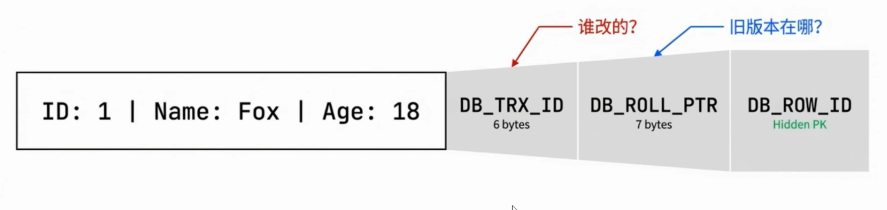
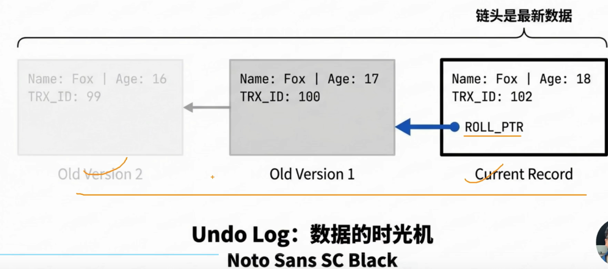
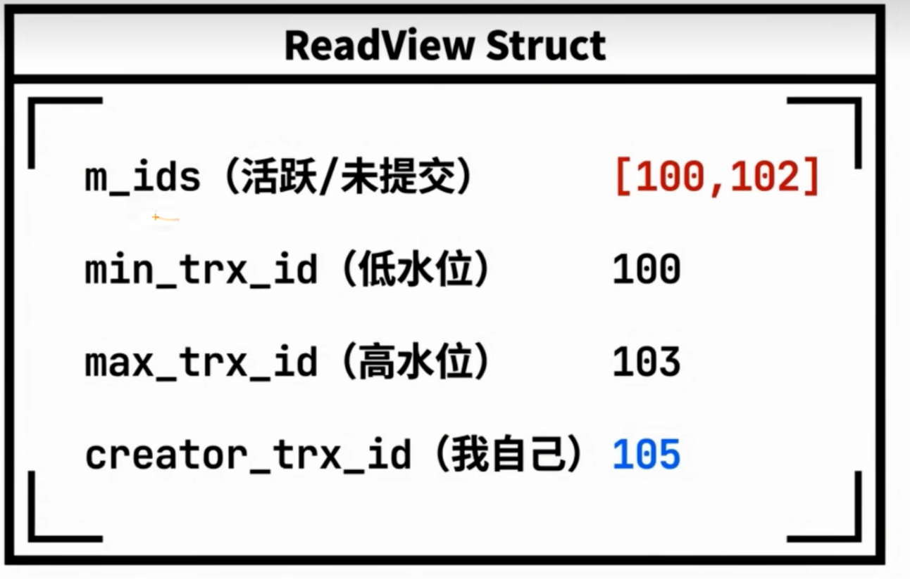
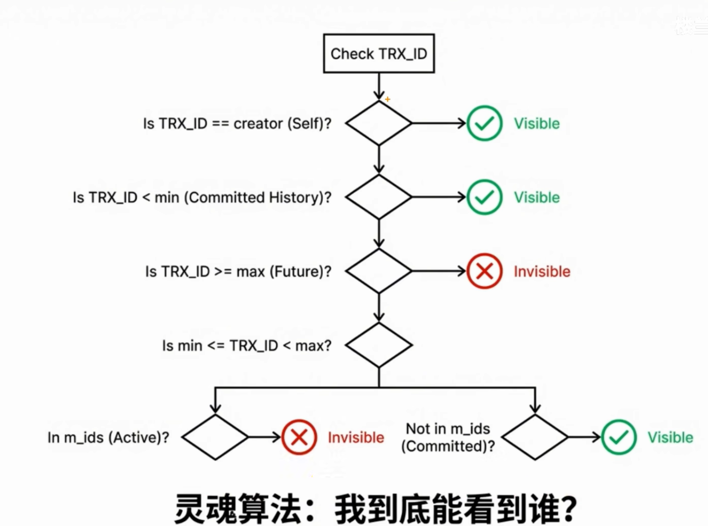
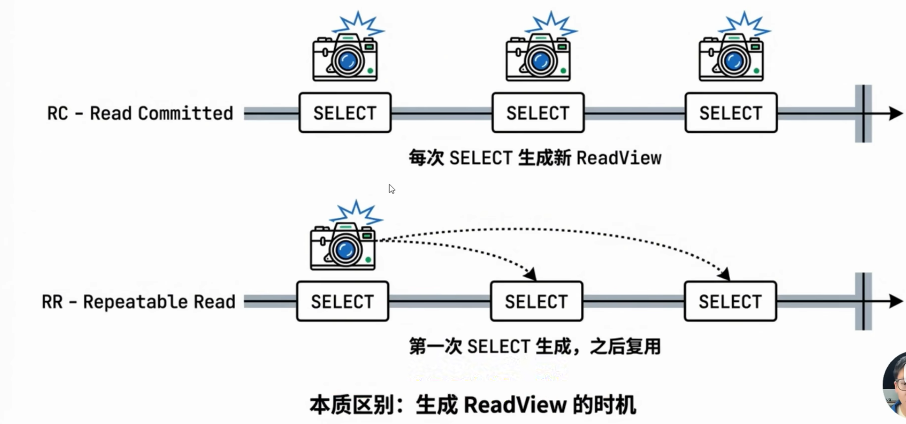
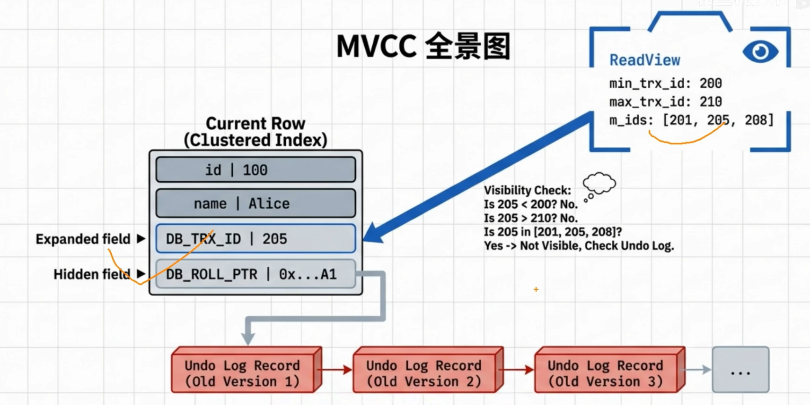
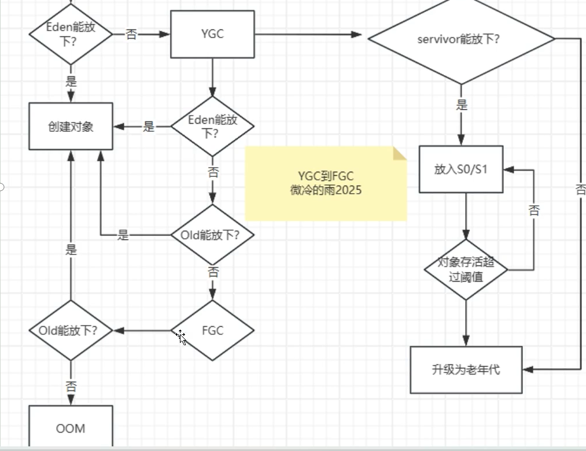

# 1、MySQL索引底层为什么是B+树？

B+树非常适合基于磁盘页管理，适合范围查找，B+树是多叉平衡树，
InnoDB的主键索引是局促索引，数据存放在叶子节点上，二级索引的叶子阶段存的是主键，所以通过二级索引查找完整数据时，可能还要回表


# 2、项目中用过哪些设计模式
**消息通知系统**
可能走短信，走邮件，走企业微信，走飞书等各种渠道，每个处理方的逻辑是不一样的，调用方是活的
先定义一个Notify service接口，调用方只认这个接口，具体用那个渠道可以随时切换，这个就是**策略模式**。
每个渠道的都有，校验、发送逻辑虽然逻辑不同，但是整体的流程是一样。都是需要先校验，在发送，最后记录日志。如果每个渠道的实现都写一遍代码会很冗余。在接口的具体的渠道之间加一层抽象类，而这个抽象类实现接口send方法，把里面的流程编排好，先校验在调发送最后记录日志，校验和发送声明一个抽象方法，留给各个渠道重新，记录日志在父类里写死，这就是典型的**模板方法**

调用方怎么拿到对应的渠道实现：可以用简单工厂你去定义一个注解，每个渠道实现类标注自己的渠道标志，项目启动，把它扫描到自己的注解，收集到Map里面，调用的时候你可以按标志去取，新增渠道的，只需要加一个类，打上注解，工厂不用改，开闭原则。
**模板方法和策略模式到底有什么区别**？
模板方法：强调的流程复用，变化是流程里某些步骤。就是流程我定好了，变化的步骤你来填。
策略模式：强调的行为切换，变化的是整个实现。目标我定好了，整个怎么做的你自己说了算

策略：解决调用方的渠道切换
模板方法：解决实现方的流程复用
工厂：负责路由选择


# 3、Mysql 多版本并发控制 MVCC
为什么需要mvCC,？维护数据的多个版本，读写解耦，无所并行，提升性能
**MVCC 三大结构，隐藏字段，Undo log，ReadView,**
**隐藏字段：**
事务ID,
回滚指针：指向Undolog里这行数据的上一个版本
主键：
二级索引有这两个隐藏字段吗？没有，二级索引页头有个PAGE_MAX_TRX_ID，如果这个id小于当前事务的可见性水位，直接读，否则需要回表到聚族索引上的DB_TRX_ID和Undo Log来做版本判断


**Undo log**

**ReadVIew**:快照切片可见性裁判


m_ids:未提交的事务ID列表
min_trx_id:
max_trx_id
creator_trx_id



隔离级别为RC情况下select语句每次生成心的ReadView,只要别的事务提交了，我下次select生成的新视图时就能看到
在RR级别下，而是在事务执行的第一条快照读select时生成Readview



**MVCC能解决幻读吗？**
MVCC解决了快照读下的幻读，但是没有解决当前读下的幻读，普通的SELECT是快照读，靠ReadView复用，确实看不到新插入的数据。但是select for update 或者up达特1是当前读，这些操作必须读最新版，如果不加锁,别人插入新数据，你就能更新到，产生幻读，在RR级别下当前读是通过Next-Key Lock临界锁锁住间隙来彻底解决幻读
**看不见的数据我能update吗**
能，更新完后在此select就能看见了，update是当前读，他不看Read View,直接读最新提交的数据，所以能更新成功

**Undo Log会无线膨胀吗？**
当然不会，Mysql有Purge线程，当系统中最老的ReadView都不再需要某个事务版本之前的记录时，purge线程就会自动清理掉哪些无用的Undo Log,这也是为什么不要在生产环境搞长事务，长事务会导致ReadView一直不关闭，导致表空间极速膨胀，查询变慢


# 4、Java中的对象一定在堆上分配吗 
在Java中，对象的内存分配通常发生在堆上，但并非绝对。
### 1.常规情况：堆分配
堆是对象分配的主要区域：Jva通过new关键字创建的对象实例和数组，默认在堆内存中
分配。堆由垃圾回收器(GC)管理，生命周期由M的垃圾回收策略决定。
线程共享与同步开销：堆是线程共享的，对象分配可能涉及同步机制（如TLAB优化），但
本质上仍在堆内。
### 2.优化场景：栈分配与标量替换
**逃逸分析(Escape Analysis):**
VM(如HotSpot)在T编译时，会分析对象的作用域。若对象未逃逸（即仅在方法内
部使用，未被外部引用或线程共享)，可能进行优化。
**栈上分配：**对象直接在栈帧中分配，随方法结束自动销毁，无需GC介入。
**标量替换(Scalar Replacement)：**将对象拆解为基本类型（标量），存储在栈帧或寄存
器中，避免对象整体分配。
### 4.其他相关机制 

TLAB(Thread-Local Allocation Buffer):堆内为每个线程划分的私有区域，用于快速分
配对象，减少锁竞争，但仍属于堆内存。
大对象直接进入老年代：某些M对超大对象（如长数组）直接分配在老年代，避免频繁
GC,但仍在堆内。

Jva对象通常分配在堆上，但在VM通过逃逸分析优化后，未逃逸对象可能栈分配或标量
替换，从而避免堆内存开销。开发者通常无需关注此细节，优化由M自动完成。因此，
严格来说，Java对象不绝对在堆上分配，但大多数情况下确实如此。

# 5、Java对象创建分配



# 6、 什么是SPI,它有什么用
### 一、什么是SPI?
SPI(Service Provider Interface)是Java提供的一种服务发现机制，允许框架或核心库
动态加载第三方实现，而无需硬编码依赖。其核心思想是面向接口编程，通过配置文件实现
接口与实现的解耦，常用于构建可扩展的插件化架构。
### 二、应用场景
**1.JDBC驱动加载**
传统方式：需手动注册驱动类（如Class.forName("com.mysql.jdbc.Driver")。
SPI方式：JDK6+后，驱动JAR包通过META-lNF/services/java.sql.Driver自动注册。
**2.日志框架桥接（如SLF4J)**
SLF4J通过SPI发现具体的日志实现(Logback、.Log4j2等)。
配置文件示例：META-lNF/services/org.slf4j.impl.StaticLoggerBinder
**3.Spring Boot自动配置**
Spring Boot的spring.factories文件本质是SPl的扩展。
文件路径：META-lNF/spring.factories
内容示例：

# 7、HashMap的哈市冲突如何解决的
哈希冲突(Hash Collision)是指不同的键通过哈希函数计算后，得到的哈希值（或数组索
引)相同。由于HashMap使用有限的数组存储数据，而键的取值范围可能是无限的，冲
突不可避免。
**1.链地址法(Separate Chaining)**
基本原理：每个数组（桶）位置存储一个链表或红黑树。当多个键的哈希值映射到同一位置
时，这些键值对以链表形式链接；当链表长度超过阈值时，转换为红黑树以提高查询效率。
数据结构：
数组+链表（默认）：哈希冲突的键值对以链表形式存储。
数组+红黑树(Jva8+):链表长度超过阈值（默认为8）时，自动转换为红黑树；节
点数减少到阈值以下（默认为6）时，恢复为链表。
**2.哈希函数优化**
扰动函数：对键的hashCode()进行二次处理，减少哈希冲突概率。

**3.动态扩容(Rehashing)**
负载因子(Load Factor)：默认0.75，当元素数量超过容量×负载因子时触发扩容。
扩容流程：
新建一个2倍大小的数组。
重新计算所有元素的哈希值并分配到新数组的对应位置。
迁移后引旧数组被丢弃，新数组成为主存储结构。
效果：减少哈希冲突概率，提高查询效率。

**4.红黑树优化(Java8+)**
转换条件：
链表→红黑树：链表长度≥8且数组容量≥64（否则优先扩容）。
红黑树→链表：节点数≤6。
优势：红黑树的查找时间复杂度为Oog),显著优化长链表的性能。
# 8、什么是拆包和粘包？怎么解决
**一、什么是拆包和粘包？**
在基于流的传输协议（如TCP)中，数据没有明确的边界标识，发送方的多次写入操作可
能被接收方一次性读取，或一次写入的数据被接收方分多次读取。这种现象会导致以下两种
问题：
**粘包(Packet Sticking)**
多个数据包被合并成一个大的数据块接收（例如：发送方连续发送AB,接收方可能一次性
收到AB)。
**拆包(Packet Splitting)**
一个数据包被拆分成多个小块接收（例如：发送方发送BigData,接收方可能先收到Bi,
再收到gData)
**二、问题根源**
TCP协议特性：TCP是面向字节流的协议，保证数据可靠性和顺序性，但不维护数据边界
缓冲区机制：发送方和接收方的缓冲区大小、网络状况（如MTU限制）可能导致数据分
段或合并。
Nagle算法：为提高网络效率，TCP可能合并多个小数据包发送。

**三、解决方案**
以下是常见的解决方案，按实现复杂度排序：
**1.固定长度法(Fixed-Length)**
核心思想：每个数据包长度固定，不足部分用填充字符补全。
优点：实现简单，解码高效。
缺点：浪费带宽，不适合变长数据。

**2.分隔符法(Delimiter-Based)**
核心思想：用特殊字符（如n)标记数据包结束。
实现方式（以Netty为例）：
```java
//添加行解码器（按1n或1r1n分割）
pipeline.addLast(new LineBasedFrameDecoder(1024));
pipeline.addLast(new StringDecoder());
```
**不适合二进制数据（可能包含份隔符字节）。**
优化方案：使用复杂分隔符（如#$%）降低冲突概率。
**3.长度字段法(Length Field-Based)**
核心思想：在数据包头添加长度字段，明确标识包体长度。
协议格式：

**4.高级协议设计**
HTTP/1.1:使用Content-Length或Transfer-.Encoding:chunked。.
HTTP/2:通过二进制分帧层(Frame)划分数据边界。
自定义协议：结合长度字段、魔数(Magic Number)、校验码(CRC)等提高健壮性。