# 1、MySQL索引底层为什么是B+树？

B+树非常适合基于磁盘页管理，适合范围查找，B+树是多叉平衡树，
InnoDB的主键索引是局促索引，数据存放在叶子节点上，二级索引的叶子阶段存的是主键，所以通过二级索引查找完整数据时，可能还要回表


# 2、项目中用过哪些设计模式
**消息通知系统**
可能走短信，走邮件，走企业微信，走飞书等各种渠道，每个处理方的逻辑是不一样的，调用方是活的
先定义一个Notify service接口，调用方只认这个接口，具体用那个渠道可以随时切换，这个就是**策略模式**。
每个渠道的都有，校验、发送逻辑虽然逻辑不同，但是整体的流程是一样。都是需要先校验，在发送，最后记录日志。如果每个渠道的实现都写一遍代码会很冗余。在接口的具体的渠道之间加一层抽象类，而这个抽象类实现接口send方法，把里面的流程编排好，先校验-调发送-最后记录日志，校验和发送声明一个抽象方法，留给各个渠道重写，记录日志在父类里写死，这就是典型的**模板方法**

调用方怎么拿到对应的渠道实现：可以用简单工厂去定义一个注解，每个渠道实现类标注自己的渠道标志，项目启动，把它扫描到自己的注解，收集到Map里面，调用的时候你可以按标志去取，新增渠道的，只需要加一个类，打上注解，工厂不用改，开闭原则。
**模板方法和策略模式到底有什么区别**？
模板方法：强调的流程复用，变化是流程里某些步骤。就是流程我定好了，变化的步骤你来填。
策略模式：强调的行为切换，变化的是整个实现。目标我定好了，整个怎么做的你自己说了算

策略：解决调用方的渠道切换
模板方法：解决实现方的流程复用
工厂：负责路由选择


在复杂的业务系统中，消息通知（如短信、邮件、App推送、站内信等）往往面临渠道多、逻辑杂、难扩展的问题。将**工厂模式**、**模板方法模式**和**策略模式**结合起来，是解决这一问题的黄金架构。

这三种模式在其中的分工非常明确：
- **策略模式**：解决“多态”问题。为每种通知渠道定义独立的实现，实现发送逻辑的隔离与替换。
- **模板方法模式**：解决“代码复用”问题。将消息发送的固定流程（如：参数校验 -> 组装内容 -> 调用渠道 -> 记录日志）固化，只将“调用渠道”这一步留给策略去实现。
- **工厂模式**：解决“对象创建与路由”问题。根据传入的通知类型，动态获取对应的策略实例，屏蔽底层的创建细节。
下面是具体的工程化实现方案：
### 1. 定义消息上下文（参数载体）

首先，们需要一个统一的对象来承载发送消息所需的各种数据，避免方法参数过长。
```java
@Data
@Builder
public class NotifyContext {
    private String userId;          // 接收人ID
    private String channelType;     // 渠道类型（如：SMS, EMAIL）
    private Map<String, String> params; // 模板参数
    private String content;         // 最终组装好的内容
}
```
### 2. 模板方法 + 策略模式（核心抽象与实现）
定义一个抽象类，固化发送流程，并将具体的发送动作定义为抽象方法（策略接口）。
```java
public abstract class AbstractNotifyStrategy {

    /**
     * 模板方法：定义消息发送的标准流程
     * 加上 final 防止子类篡改流程
     */
    public final void send(NotifyContext context) {
        // 1. 前置校验
        validate(context);
        // 2. 组装消息内容
        assembleContent(context);
        // 3. 执行具体渠道的发送（由策略子类实现）
        doSend(context);
        // 4. 记录发送日志
        logSendResult(context);
    }

    // 通用校验逻辑
    private void validate(NotifyContext context) {
        if (context.getUserId() == null) {
            throw new IllegalArgumentException("用户ID不能为空");
        }
    }

    // 通用内容组装逻辑
    private void assembleContent(NotifyContext context) {
        // 假设这里根据 params 和模板引擎渲染 content
        context.setContent("渲染后的内容...");
    }

    // 【策略方法】：具体的发送动作，交由子类实现
    protected abstract void doSend(NotifyContext context);

    // 通用日志记录
    private void logSendResult(NotifyContext context) {
        System.out.println("记录日志: " + context.getChannelType() + " 发送成功");
    }
}
```
接下来，实现具体的策略类：
```java
// 短信策略
@Component("SMS") // Bean的名称作为策略标识
public class SmsNotifyStrategy extends AbstractNotifyStrategy {
    @Override
    protected void doSend(NotifyContext context) {
        System.out.println("调用阿里云API发送短信: " + context.getContent());
    }
}

// 邮件策略
@Component("EMAIL")
public class EmailNotifyStrategy extends AbstractNotifyStrategy {
    @Override
    protected void doSend(NotifyContext context) {
        System.out.println("调用SMTP服务发送邮件: " + context.getContent());
    }
}
```
### 3. 工厂模式（统一路由与分发）

利用 Spring 的依赖注入，将所有的策略实现自动收集到工厂中，实现动态路由。
```java
@Component
public class NotifyStrategyFactory {

    // Spring 会自动将所有 AbstractNotifyStrategy 类型的 Bean 注入到这个 Map 中
    // Key = Bean的名称 (即 @Component("SMS") 中的 SMS)
    // Value = 对应的策略实例
    @Autowired
    private Map<String, AbstractNotifyStrategy> strategyMap;

    /**
     * 根据渠道类型获取对应的策略
     */
    public AbstractNotifyStrategy getStrategy(String channelType) {
        AbstractNotifyStrategy strategy = strategyMap.get(channelType);
        if (strategy == null) {
            throw new UnsupportedOperationException("不支持的通知渠道: " + channelType);
        }
        return strategy;
    }
}
```

### 4. 业务调用层（极简调用）

经过上述封装后，业务层（如 Controller 或 Service）的代码将变得极其干净，完全不需要 `if-else` 或 `switch-case`：
```java
@Service
public class MessageService {

    @Autowired
    private NotifyStrategyFactory notifyStrategyFactory;

    public void notifyUser(String channelType, String userId, Map<String, String> params) {
        // 1. 构建上下文
        NotifyContext context = NotifyContext.builder()
                .channelType(channelType)
                .userId(userId)
                .params(params)
                .build();
        
        // 2. 工厂获取策略并执行模板方法
        notifyStrategyFactory.getStrategy(channelType).send(context);
    }
}
```
### 💡 这种架构的扩展性优势
假设明天产品经理要求新增一个 **App推送** 渠道，你**完全不需要修改现有的任何代码**（符合开闭原则 OCP）：
1. 新建一个 `AppPushNotifyStrategy` 继承 `AbstractNotifyStrategy`。
2. 实现 `doSend` 方法，加上 `@Component("APP_PUSH")` 注解。
3. 业务层传入 `channelType = "APP_PUSH"` 即可自动路由。

这套组合拳不仅消除了复杂的条件分支，还保证了核心流程（如校验、日志）的绝对统一，是大型系统中处理多态业务的标杆设计。

# 2、通过封装了自定义的线程工厂，实现了线程池间的日志区分，提升了日志排查效率。
以下为你提供从**核心实现**到**高级进阶**的完整方案，非常适合用于项目总结或面试回答：
### 1. 核心实现：自定义线程工厂
通过实现 `ThreadFactory` 接口，利用 `AtomicInteger` 保证线程命名的唯一性和自增性。
```java
public class CustomThreadFactory implements ThreadFactory {
    private final AtomicInteger threadNumber = new AtomicInteger(1);
    private final String namePrefix;

    public CustomThreadFactory(String poolName) {
        this.namePrefix = "Biz-Pool-" + poolName + "-";
    }

    @Override
    public Thread newThread(Runnable r) {
        Thread t = new Thread(r, namePrefix + threadNumber.getAndIncrement());
        // 【关键优化】：设置为非守护线程，防止主线程结束后异步任务被意外中断
        t.setDaemon(false); 
        // 【关键优化】：设置统一优先级
        t.setPriority(Thread.NORM_PRIORITY); 
        return t;
    }
}
```
### 2. 结合线程池构建器使用
在创建线程池时，将自定义工厂注入，实现线程池间的物理隔离与日志区分。
```java
ThreadPoolExecutor orderPool = new ThreadPoolExecutor(
    5, 10, 60L, TimeUnit.SECONDS,
    new LinkedBlockingQueue<>(1000),
    new CustomThreadFactory("OrderService"), // 订单业务线程池
    new ThreadPoolExecutor.CallerRunsPolicy()
);

ThreadPoolExecutor notifyPool = new ThreadPoolExecutor(
    5, 10, 60L, TimeUnit.SECONDS,
    new LinkedBlockingQueue<>(1000),
    new CustomThreadFactory("NotifyService"), // 通知业务线程池
    new ThreadPoolExecutor.CallerRunsPolicy()
);
```
### 3. 进阶优化：结合 MDC 实现全链路日志追踪（亮点）
仅仅给线程改名还不够，更高级的做法是结合 SLF4J 的 **MDC (Mapped Diagnostic Context)**。当任务提交到线程池时，将主线程的上下文（如 TraceId、UserId）传递给子线程，彻底解决异步场景下日志断链的问题。
```java
public class MdcTaskDecorator implements TaskDecorator {
    @Override
    public Runnable decorate(Runnable runnable) {
        // 1. 在主线程中捕获 MDC 上下文
        Map<String, String> contextMap = MDC.getCopyOfContextMap();
        
        return () -> {
            try {
                // 2. 在子线程执行前，恢复 MDC 上下文
                if (contextMap != null) {
                    MDC.setContextMap(contextMap);
                }
                runnable.run();
            } finally {
                // 3. 执行完毕后清理，防止线程池复用导致的数据污染
                MDC.clear();
            }
        };
    }
}
```

_注：如果使用 Spring 的 `ThreadPoolTaskExecutor`，只需调用 `executor.setTaskDecorator(new MdcTaskDecorator())` 即可完美生效。_
### 4. 面试/简历话术提炼
如果你要将这个优化写在简历或面试中讲述，可以参考以下结构：
> **项目难点与优化**：在微服务异步处理场景下，曾遇到多线程并发导致日志混杂、异步链路追踪断裂、CPU 异常难以定位等问题。  
> **解决方案**：
> 1. 自主封装了 `CustomThreadFactory`，基于 `AtomicInteger` 实现了各业务线程池的命名隔离（如 `Biz-Pool-Order-1`），使日志排查效率提升 50% 以上。
> 2. 结合 SLF4J 的 MDC 机制，实现了 `TaskDecorator` 上下文传递装饰器，解决了异步任务中 TraceId 丢失的痛点，实现了全链路日志追踪。
> 3. 规范了线程池的创建标准，统一配置了合理的拒绝策略与守护线程属性，避免了线上 OOM 和任务意外中断的风险。

# 2、通过自定义注解、AOP 和ThreadLocal 实现动态数据源切换，并结合参数校验，确保系统在多数据源环境下的稳定性与安全。
我基于 Spring 的 `AbstractRoutingDataSource` 实现了动态数据源切换。通过自定义 `@DataSource` 注解标记方法，利用 AOP 在方法执行前解析注解并将目标数据源名存入 ThreadLocal，最后在 `determineCurrentLookupKey()` 中取出并路由。为了保证安全性，我在 AOP 前置通知中增加了多层校验：数据源是否存在、当前租户是否有权访问该数据源、以及参数是否含有 SQL 注入风险。同时，在 `finally` 块中强制清除 ThreadLocal，防止内存泄漏和线程复用时的数据污染

# 3、Mysql 多版本并发控制 MVCC
为什么需要mvCC,？维护数据的多个版本，读写解耦，无所并行，提升性能
**MVCC 三大结构，隐藏字段，Undo log，ReadView,**
**隐藏字段：**
事务ID,
回滚指针：指向Undolog里这行数据的上一个版本
主键：
二级索引有这两个隐藏字段吗？没有，二级索引页头有个PAGE_MAX_TRX_ID，如果这个id小于当前事务的可见性水位，直接读，否则需要回表到聚族索引上的DB_TRX_ID和Undo Log来做版本判断


**Undo log**

**ReadVIew**:快照切片可见性裁判


m_ids:未提交的事务ID列表
min_trx_id:
max_trx_id
creator_trx_id


隔离级别为RC情况下select语句每次生成新的ReadView,只要别的事务提交了，我下次select生成的新视图时就能看到
在RR级别下，而是在事务执行的第一条快照读select时生成Readview


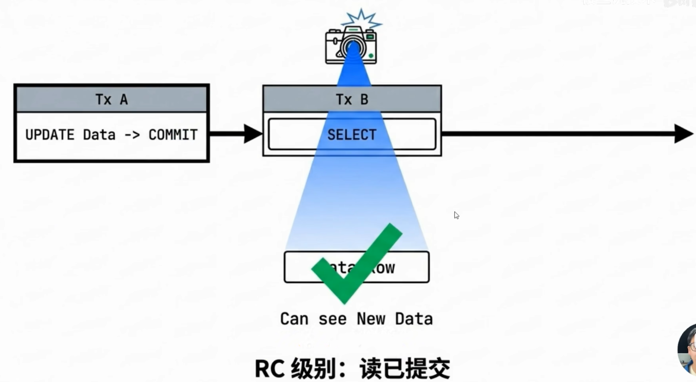

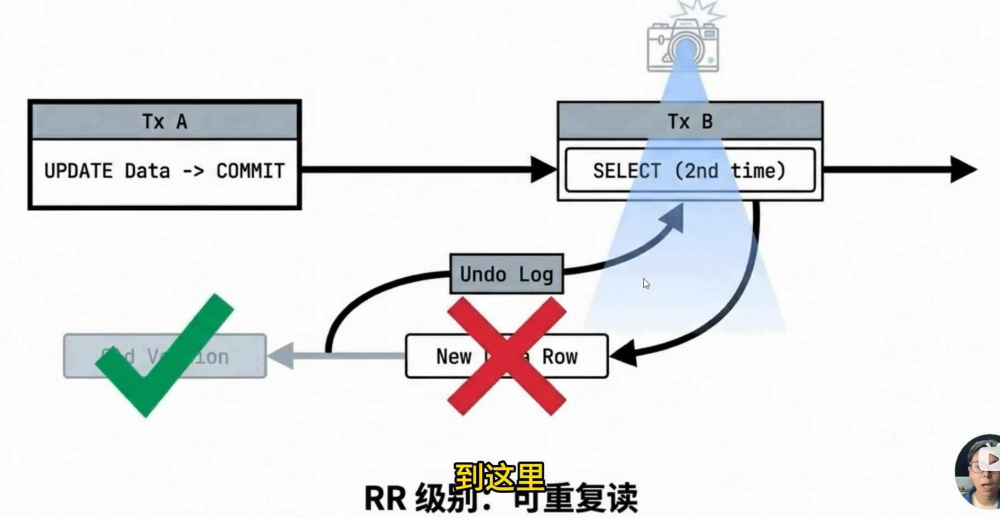

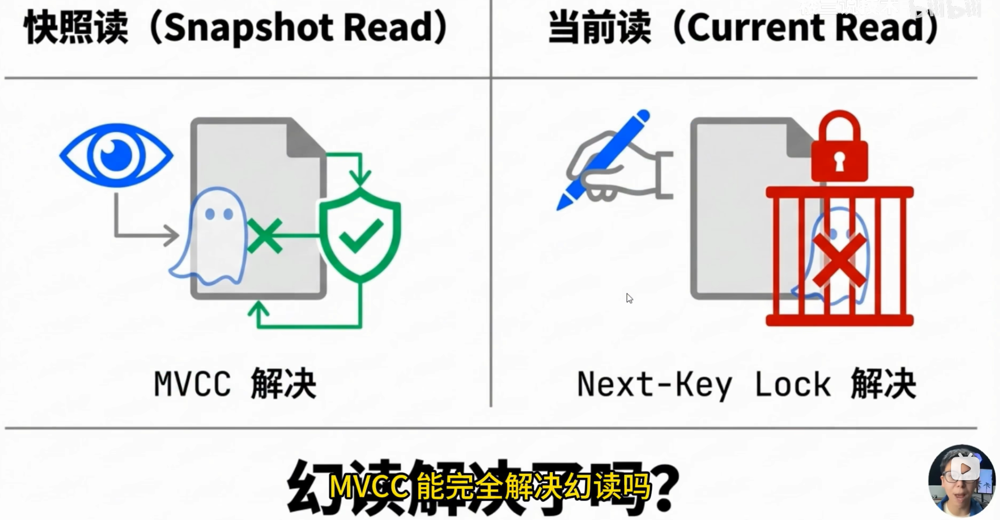

**MVCC能解决幻读吗？**
MVCC解决了快照读下的幻读，但是没有解决当前读下的幻读，普通的SELECT是快照读，靠ReadView复用，确实看不到新插入的数据。但是select for update 或者update是当前读，这些操作必须读最新版，如果不加锁,别人插入新数据，你就能更新到，产生幻读，在RR级别下当前读是通过Next-Key Lock临界锁锁住间隙来彻底解决幻读
**看不见的数据我能update吗**
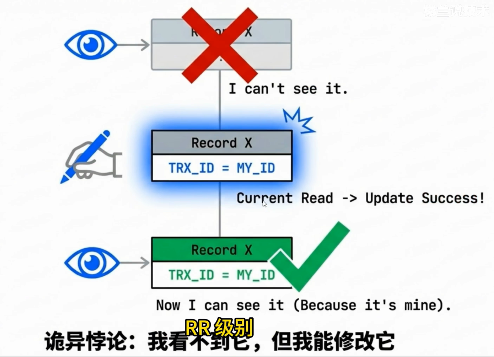能，更新完后在此select就能看见了，update是当前读，他不看Read View,直接读最新提交的数据，所以能更新成功

**Undo Log会无线膨胀吗？**
当然不会，Mysql有Purge线程，当系统中最老的ReadView都不再需要某个事务版本之前的记录时，purge线程就会自动清理掉哪些无用的Undo Log,这也是为什么不要在生产环境搞长事务，长事务会导致ReadView一直不关闭，导致表空间极速膨胀，查询变慢


# 4、Java中的对象一定在堆上分配吗 
在Java中，对象的内存分配通常发生在堆上，但并非绝对。
### 1.常规情况：堆分配
堆是对象分配的主要区域：Jva通过new关键字创建的对象实例和数组，默认在堆内存中
分配。堆由垃圾回收器(GC)管理，生命周期由JVM的垃圾回收策略决定。
线程共享与同步开销：堆是线程共享的，对象分配可能涉及同步机制（如TLAB优化），但
本质上仍在堆内。
### 2.优化场景：栈分配与标量替换
**逃逸分析(Escape Analysis):**
JVM(如HotSpot)在T编译时，会分析对象的作用域。若对象未逃逸（即仅在方法内
部使用，未被外部引用或线程共享)，可能进行优化。
**栈上分配：**对象直接在栈帧中分配，随方法结束自动销毁，无需GC介入。
**标量替换(Scalar Replacement)：**将对象拆解为基本类型（标量），存储在栈帧或寄存
器中，避免对象整体分配。
### 4.其他相关机制 

TLAB(Thread-Local Allocation Buffer):堆内为每个线程划分的私有区域，用于快速分
配对象，减少锁竞争，但仍属于堆内存。
大对象直接进入老年代：某些M对超大对象（如长数组）直接分配在老年代，避免频繁
GC,但仍在堆内。

Jva对象通常分配在堆上，但在VM通过逃逸分析优化后，未逃逸对象可能栈分配或标量
替换，从而避免堆内存开销。开发者通常无需关注此细节，优化由M自动完成。因此，
严格来说，Java对象不绝对在堆上分配，但大多数情况下确实如此。

# 5、Java对象创建分配


# 6、 什么是SPI,它有什么用
### 一、什么是SPI?
SPI(Service Provider Interface)是Java提供的一种服务发现机制，允许框架或核心库
动态加载第三方实现，而无需硬编码依赖。其核心思想是面向接口编程，通过配置文件实现
接口与实现的解耦，常用于构建可扩展的插件化架构。
### 二、应用场景
**1.JDBC驱动加载**
传统方式：需手动注册驱动类（如Class.forName("com.mysql.jdbc.Driver")。
SPI方式：JDK6+后，驱动JAR包通过META-lNF/services/java.sql.Driver自动注册。
**2.日志框架桥接（如SLF4J)**
SLF4J通过SPI发现具体的日志实现(Logback、.Log4j2等)。
配置文件示例：META-lNF/services/org.slf4j.impl.StaticLoggerBinder
**3.Spring Boot自动配置**
Spring Boot的spring.factories文件本质是SPl的扩展。
文件路径：META-lNF/spring.factories
内容示例：

# 7、HashMap的hash冲突如何解决的
哈希冲突(Hash Collision)是指不同的键通过哈希函数计算后，得到的哈希值（或数组索
引)相同。由于HashMap使用有限的数组存储数据，而键的取值范围可能是无限的，冲
突不可避免。
**1.链地址法(Separate Chaining)**
基本原理：每个数组（桶）位置存储一个链表或红黑树。当多个键的哈希值映射到同一位置
时，这些键值对以链表形式链接；当链表长度超过阈值时，转换为红黑树以提高查询效率。
数据结构：
数组+链表（默认）：哈希冲突的键值对以链表形式存储。
数组+红黑树(Jva8+):链表长度超过阈值（默认为8）时，自动转换为红黑树；节
点数减少到阈值以下（默认为6）时，恢复为链表。
**2.哈希函数优化**
扰动函数：对键的hashCode()进行二次处理，减少哈希冲突概率。

**3.动态扩容(Rehashing)**
负载因子(Load Factor)：默认0.75，当元素数量超过容量×负载因子时触发扩容。
扩容流程：
新建一个2倍大小的数组。
重新计算所有元素的哈希值并分配到新数组的对应位置。
迁移后引旧数组被丢弃，新数组成为主存储结构。
效果：减少哈希冲突概率，提高查询效率。

**4.红黑树优化(Java8+)**
转换条件：
链表→红黑树：链表长度≥8且数组容量≥64（否则优先扩容）。
红黑树→链表：节点数≤6。
优势：红黑树的查找时间复杂度为Oog),显著优化长链表的性能。
# 8、什么是拆包和粘包？怎么解决
**一、什么是拆包和粘包？**
在基于流的传输协议（如TCP)中，数据没有明确的边界标识，发送方的多次写入操作可
能被接收方一次性读取，或一次写入的数据被接收方分多次读取。这种现象会导致以下两种
问题：
**粘包(Packet Sticking)**
多个数据包被合并成一个大的数据块接收（例如：发送方连续发送AB,接收方可能一次性
收到AB)。
**拆包(Packet Splitting)**
一个数据包被拆分成多个小块接收（例如：发送方发送BigData,接收方可能先收到Bi,
再收到gData)
**二、问题根源**
TCP协议特性：TCP是面向字节流的协议，保证数据可靠性和顺序性，但不维护数据边界
缓冲区机制：发送方和接收方的缓冲区大小、网络状况（如MTU限制）可能导致数据分
段或合并。
Nagle算法：为提高网络效率，TCP可能合并多个小数据包发送。

**三、解决方案**
以下是常见的解决方案，按实现复杂度排序：
**1.固定长度法(Fixed-Length)**
核心思想：每个数据包长度固定，不足部分用填充字符补全。
优点：实现简单，解码高效。
缺点：浪费带宽，不适合变长数据。

**2.分隔符法(Delimiter-Based)**
核心思想：用特殊字符（如n)标记数据包结束。
实现方式（以Netty为例）：
```java
//添加行解码器（按1n或1r1n分割）
pipeline.addLast(new LineBasedFrameDecoder(1024));
pipeline.addLast(new StringDecoder());
```
**不适合二进制数据（可能包含份隔符字节）。**
优化方案：使用复杂分隔符（如#$%）降低冲突概率。
**3.长度字段法(Length Field-Based)**
核心思想：在数据包头添加长度字段，明确标识包体长度。
协议格式：
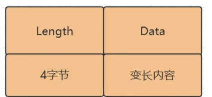
**4.高级协议设计**
HTTP/1.1:使用Content-Length或Transfer-.Encoding:chunked。.
HTTP/2:通过二进制分帧层(Frame)划分数据边界。
自定义协议：结合长度字段、魔数(Magic Number)、校验码(CRC)等提高健壮性。
# 9、讲一下对象的创建过程
**1.类加载检查**
当VM遇到new指令时，首先检查对应的类是否已经加载、解析、初始化。
若未加载：触发类加载过程(加载→验证→准备→解析→初始化)。
若已加载：直接进入内存分配阶段。
**2.内存分配**
JVM为对象分配内存空间（堆内存），分配方式取决于堆内存的规整性：
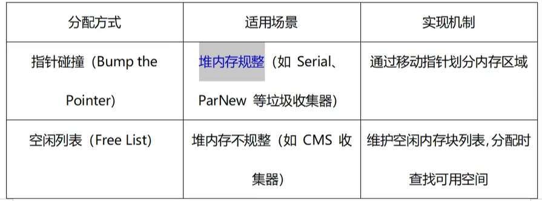
**3.初始化零值**
内存分配完成后IVM将对象的所有实例变量初始化为零值（默认值）：
- int赋值为0
- boolean赋值为false
- 引用类型赋值为null
**4.设置对象头(Object Header)**
JVM在对象头中存储元数据信息，包括：
Mark Word:哈希码、GC分代年龄、锁状态标志等。
类型指针：指向类元数据的指针（用于确定对象类型)。
对象头结构示意图：
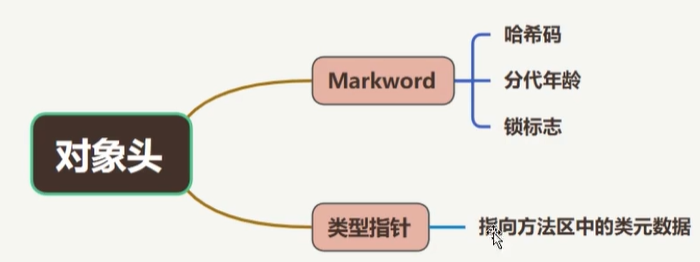
**5、执行init方法（构造方法）**
执行对象的构造函数(init方法)，完成以下操作：
调用父类构造函数（递剃归执付
显式初始化成员变量（如int age=18;)。
执行构造代码块和构造函数中的代码。
**6.对象引用关联**
将堆内存中的对象地址赋值给栈中的引用变量，完成对象创建。

总结
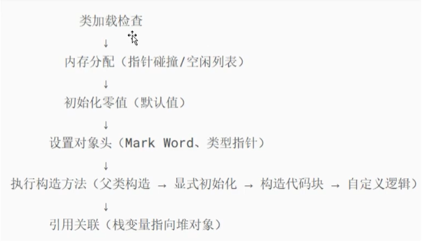
# 10、Mysql是如何解决幻读的
**MySQL通过可重复读(Repeatable Read)隔离级别下的MVCC(多版本并发控制)和**
**间隙锁(Gap Lock)机制解决幻读问题**
**一、幻读的定义与场景**
幻读是指在同一事务中，多次执行相同范围的查询时，由于其他事务插入或删除符合该范围
的数据，导致前后结果集不一致的现象。
**示例场景：**
事务A查询年龄在20~30岁的用户，返回5条记录。
事务B插入一个年龄为25岁的新用户并提交。
事务A再次查询相同范围，发现返回6条记录（多了一条事务B插入的数据）
**二、Mysql如何解决幻读**
1.MVCC(多版本并发控制)
原理：
每个事务启动时生成一个一致性视图(Read View)，后续查询基于该视图读取数据快照，
即使其他事务修改或插入数据，当前事务看到的仍是快照版本。
解决快照读的幻读：
对于普通SELECT语句（快照读），MVCC保证事务内多次查询结果一致，不会看到其他
事务插入的新数据。
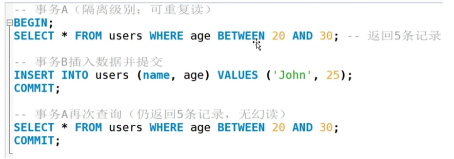
结果：事务A两次查询结果一致，VCC通过快照隔离避免了幻读。
2.间隙锁(Gap Lock)
原理：
针对当前读（如SELECT.FOR UPDATE或UPDATE/DELETE语句），InnoDB在索引记
录的间隙加锁，阻止其他事务在范围内插入新数据。
解决当前读的幻读：
锁定查询范围的“间隙”（即使该位置无实际数据），确保事务执行期间不会有新数据插入。
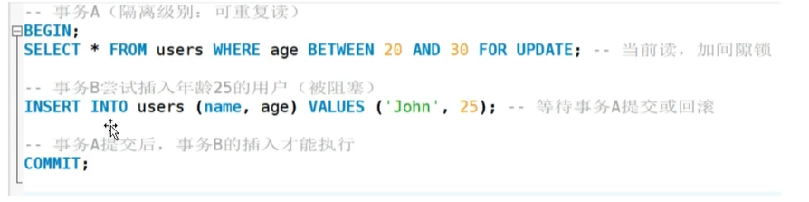
**三、关键注意事项**


# 11、存储MD5选择CHAR还是VARCHAR
存储MD5值建议使用CHAR(32),CHAR是定长，VARCHAR是可变长度，占用空间为 实际字符数
+长度标识。CHAR读写效率都要比VARCHAR高。
固定长度的CHAR字段在索引、排序、哈希计算等操作更高效，因为数据库引擎可直接按固定长度处理，无需解析动态长度。
对于Mysql的InnoDb引擎，固定长度字段更容易对齐内存页，减少碎片化。
# 12、Mysql的行级锁到底锁的是什么东西？
**Mysql的行级锁在InnoDb存储引擎中通过锁定索引记录来实现。其核心是锁住索引项而非物理数据行。**

MySQL 的行级锁（特指 InnoDB 存储引擎）**本质上锁住的并不是物理数据行本身，而是索引记录**。
具体锁定的对象和表现，取决于 SQL 语句是否命中了索引，主要分为以下几种情况：
**1. 命中主键或唯一索引**  
当 SQL 语句精确匹配到主键或唯一索引时，行锁会直接加在该索引对应的记录上。这是最标准的行锁，粒度最小，并发性能最高。

**2. 命中普通（二级）索引**  
如果 SQL 语句命中了普通索引，InnoDB 会先在命中的二级索引记录上加锁，然后再回表到聚簇索引（主键索引），对对应的主键记录也加锁。

**3. 未命中任何索引（退化为表锁）**  
如果 SQL 语句的 `WHERE` 条件没有命中任何索引，InnoDB 将无法精确定位记录。此时它会进行全表扫描，并对扫描到的所有索引记录加锁。虽然名义上还是“行锁”，但实际效果等同于锁住了整张表，会导致严重的并发阻塞。

此外，在可重复读（RR）隔离级别下，为了防止幻读，InnoDB 的行锁还会衍生出更复杂的锁定对象：

- **间隙锁（Gap Lock）**：锁定的不是具体的记录，而是索引记录之间的“间隙”（开区间），防止其他事务在间隙中插入新数据。
- **临键锁（Next-Key Lock）**：这是记录锁和间隙锁的组合，锁定的是一个左开右闭的区间（如 `(a, b]`），既锁记录也锁间隙，是 InnoDB 在 RR 级别下的默认行锁算法。

**总结与避坑建议：**  
理解“行锁即索引锁”是优化数据库性能的关键。在实际开发中，务必确保 `UPDATE`、`DELETE` 或 `SELECT ... FOR UPDATE` 等语句的 `WHERE` 条件能够命中索引。你可以使用 `EXPLAIN` 关键字分析 SQL 执行计划，确认是否走了索引（避免 `type` 为 `ALL` 的全表扫描），以防行锁意外退化为表锁。
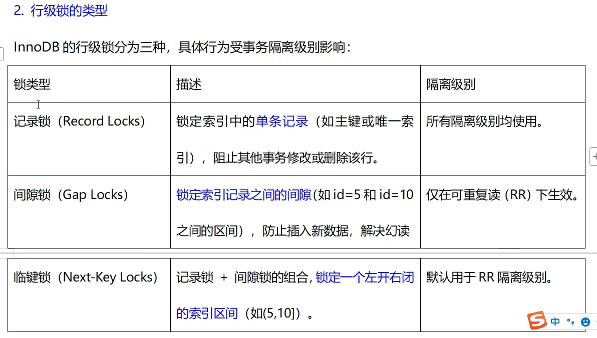
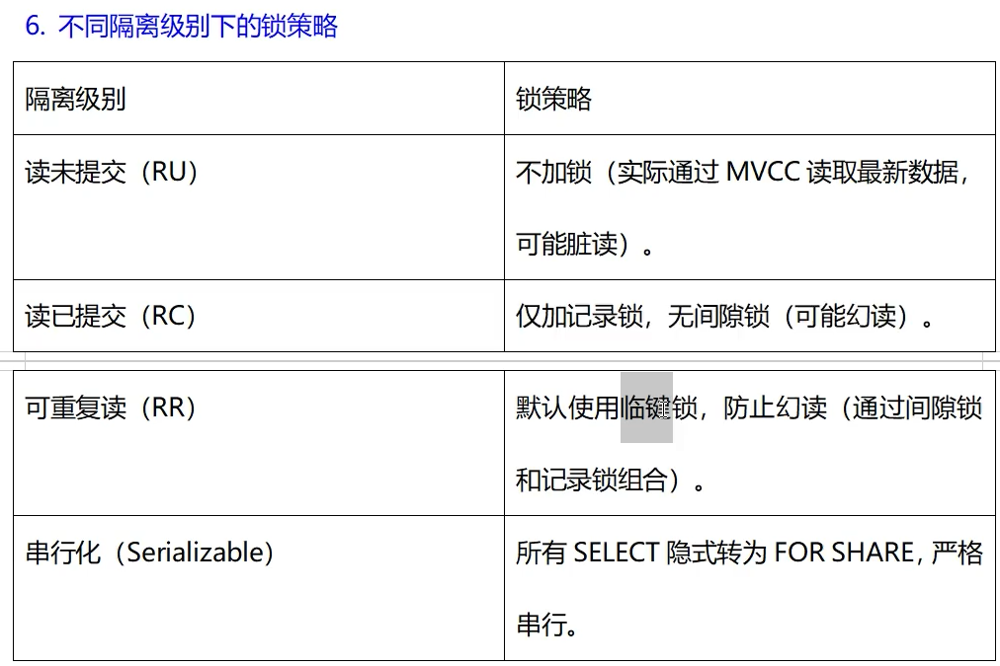

# 13、Mysql 中的 RR 隔离级别，到底有没有解决幻读问题
快照读，select通过ReadView解决、
当前读，select for update、update、delete、insert，通过间隙锁
混合场景，快照读和当前读同时存在，隔离级别选择串行化

# 14、CPU 使用率较高排查和解决
### 一、快速定位问题进程和线程，确定高CPU进程
top -c # 按cpu排序，找到占用高的Java进程PID,定位进程内高CPU线程
top -Hp PID # 查看线程级CPU占用，记录高占用的线程ID (十进制)
### 二、分析线程堆栈定位代码问题
生成线程转储(Thread Dump)文件
jstack PID >thread_dump.txt
结合十六进制线程ID,在thread dump.txt中查找对应线程的堆栈信息。在输出中寻找处于RUNNABLE状态的线程，分析它们的调用栈，找到导致高CPU的原因。
### 三、检查GC活动
关注FGC(Full GC次数)和FGCT(Full GC耗时)，频繁Full GC可能导致CPU飙升。
**jstat-gcutil PID 1000# 每秒输出一次GC统计 **
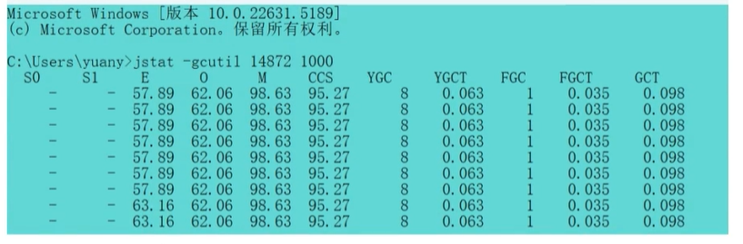
### 四、代码和配置优化

1、代码层优化
优化算法或循环逻辑(如减少不必要的计算、使用缓存)。
避免锁竞争：改用并发容器（如ConcurrentHashMap)、减小锁粒度或使用无锁结构。
2、JVM调优
调整堆大小：-Xms和-Xmx避免频繁扩容。
选择低停顿GC器：如G1或ZGC(-X:+UseG1GC)。
优化元空间：避免类加载导致Metaspace  OOM (-XX:MaxMetaspaceSize).
3、检查线程池大小，避免多线程竞争CPU,
#### 五、系统级排查
监控网络/磁盘IO,高IO等待可能间接导致CPU负载上升。
#### 六、长期预防措施
监控告警：设置阈值告警（如CPU持续>80%触发通知）。
压测与优化：定期进行压力测试，提前发现性能瓶颈。
# 15、JVM OOM问题如何排查和解决
### 一、确认OOM类型
- java.lang.OutOfMemoryError:Java heap space(堆内存不足)
- java.lang.OutOfMemoryError::Metaspace(元数据区谥出)
- java.lang.OutOfMemoryError::Direct buffer memory(直接内存溢出)
- java.lang.OutOfMemoryError:Unable to create new native thread(线程数过多)
### 二、堆内存OOM排查(Java heap space)
1.获取堆内存快照(Heap Dump)
启动时添加JVM参数-XX+HeapDumpOnOutOfMemoryError
-XX:HeapDumpPath=/path/to/dump,OOM时自动生成Dump文件。
2.分析堆内存快照
我们可以使用JProfiler。查找占用内存最大的对象(DominatorTree)。检查对象引用链(Path to GC Roots),识别是否因代码逻辑（如静态集合缓存未清理）导致内存泄漏。定位重复创建的大对象(如大数组、缓存数据)
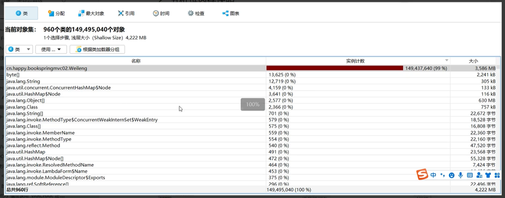
3.监控GC行为
命令：jstat-gcutil pid 1000观察GC频率和内存回收效果。
频繁Fu川GC且内存回收率低，可能为内存泄漏。结合第三方工具gceasy分析GC日志。
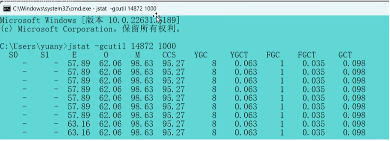
4.检查VM参数配置
确认堆大小（-Xms、-Xmx)是否合理，是否过小或未按负载调整。
检查新生代/老年代比例(-XX:NewRatio)是否合理，避免短生命周期对象晋升过快。

### 三、非堆内存OOM排查
1.Metaspace溢出
原因：动态生成类（如反射、CGLB代理）过多，或元空间配置过小。
解决：调整参数：-XX:MetaspaceSize、-XX:MaxMetaspaceSize。
检查代码，避免重复生成代理类。
2.线程数溢出
解决：
调整系统级限制(ulimit-u)。
优化线程池配置，避免无界线程池。
### 四、代码级优化
1.内存泄漏修复
静态集合缓存未清理→改用弱引用(WeakHashMap)或添加过期策略。
资源未关闭（如数据库连接、文件流）
2.减少内存占用
避免大对象频繁创建（如大数组、大字符串）→优化为分块处理或复用对象。
# 16、如果 JVM 出现频繁 FullGC该如何解决

# 17、多租户 SaaS 系统怎么设计
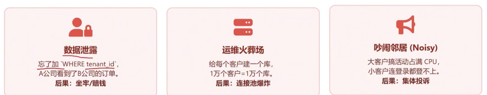
数据泄露解决方案：独立数据库，独立schema,不同颜色的点id区分
如果写sql时忘加id怎么处理，用Mybatis-Plus interceptor解决
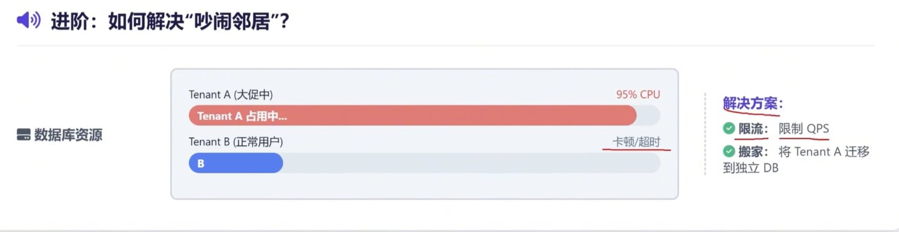

限流，设置阈值，
# 18、AQS原理
**AQS**（AbstractQueuedSynchronizer，抽象队列同步器）是 Java 并发包 `java.util.concurrent` 的核心基石。像我们常用的 `ReentrantLock`、`CountDownLatch`、`Semaphore` 等工具类，底层都是基于它实现的。

简单来说，AQS 的设计思想可以概括为：**“一个核心状态 + 一个 CLH 变体队列 + 一套模板方法”**。

下面为你层层拆解它的核心原理：

---

### 1. 核心数据结构

AQS 内部维护了两个最重要的东西：
#### ① 同步状态（`state`）
- 这是一个 `volatile int` 类型的变量。
- **作用**：代表共享资源的同步状态。
- **例子**：在 `ReentrantLock` 中，`state=0` 表示锁未被占用，`state=1` 表示被占用，`state>1` 表示重入次数。在 `CountDownLatch` 中，`state` 就是倒计数的值。
- **修改方式**：AQS 提供了三个受保护的方法：`getState()`、`setState()`、`compareAndSetState()`（基于 CAS 保证线程安全）。
#### ② CLH 变体等待队列（FIFO 双向链表）

- 当线程获取资源失败时，AQS 不会让它死循环（自旋），而是将其封装成一个 **Node** 节点，加入到一个 **FIFO 的双向链表** 中，并阻塞该线程。
- **Node 的等待状态（`waitStatus`）**：
    - `SIGNAL (-1)`：后继节点需要被唤醒。
    - `CANCELLED (1)`：节点已取消（超时或中断）。
    - `CONDITION (-2)`：节点在条件队列中。
    - `PROPAGATE (-3)`：共享模式下，传播唤醒信号。
    - `0`：初始状态。
### 2. 核心设计模式：模板方法模式

AQS 是一个抽象类，它定义了获取和释放资源的**骨架逻辑**，但把“如何判断资源是否可用”的具体实现留给子类。
子类只需要实现以下几个方法：
- `tryAcquire(int arg)`：独占模式获取资源。
- `tryRelease(int arg)`：独占模式释放资源。
- `tryAcquireShared(int arg)`：共享模式获取资源。
- `tryReleaseShared(int arg)`：共享模式释放资源。
- `isHeldExclusively()`：是否被当前线程独占。
**AQS 对外暴露的公开方法（如 `lock()`, `unlock()`）内部会调用这些 `try...` 方法。**
---

### 3. 独占模式获取锁的流程（以 `ReentrantLock` 为例）

这是面试和实战中最常问的流程：

1. **尝试获取**：调用子类的 `tryAcquire()` 尝试通过 CAS 修改 `state`。
    - **成功**：当前线程获得锁，结束。
    - **失败**：进入下一步。
2. **加入队列**：
    - 将当前线程封装成 `Node`。
    - 通过 CAS + 自旋，将节点追加到 CLH 队列的**尾部**（尾插法）。
3. **阻塞等待**：
    - 节点入队后，检查前驱节点是否是 Head。
    - **如果是 Head**：再次尝试 `tryAcquire()`（防止前驱节点刚释放，自己还没来得及竞争）。
        - 成功：将自己设为 Head，移除旧 Head。
        - 失败：继续阻塞。
    - **如果不是 Head**：检查前驱节点状态。
        - 如果前驱是 `SIGNAL`：调用 `LockSupport.park(this)` **阻塞当前线程**。
        - 如果前驱是 `CANCELLED`：向前遍历，跳过取消的节点，重新建立连接。
        - 如果前驱是 `0`：CAS 将其设为 `SIGNAL`，然后下一轮循环再阻塞。
### 4. 释放锁的流程
1. **尝试释放**：调用子类的 `tryRelease()`，通常就是 `state - 1`。
    
    - 如果 `state` 变为 0，说明完全释放。
2. **唤醒后继**：
    
    - 找到 Head 节点的**有效后继节点**（跳过 CANCELLED 的）。
    - 调用 `LockSupport.unpark(successor.thread)` 唤醒它。
3. **被唤醒后**：
    
    - 线程醒来，从 `park` 处继续执行。
    - 再次尝试 `tryAcquire()`。
    - 成功则将自己设为 Head，断开旧 Head 的引用（帮助 GC）。
### 5. 几个关键的设计细节（加分项）
1. **为什么用双向链表？**
    - 单向链表在节点取消（Cancel）时，需要从头遍历找前驱，效率低。双向链表可以直接 `node.prev` 找到前驱，快速修复链表结构。
2. **为什么唤醒后继，而不是唤醒前驱？**
    - 入队是尾插法，尾节点可能还没完全连接好（`prev` 指针可能为 null），此时如果唤醒尾节点的前驱，可能会出错。而 Head 节点的后继一定是确定的。
3. **自旋（Spin）在哪里？**
    
    - AQS 不是纯粹的自旋锁，但在**入队**和**检查前驱状态**时有短暂的自旋，这是为了避免频繁的上下文切换（OS 线程挂起/唤醒成本很高）。
4. **公平锁 vs 非公平锁**：
    
    - **非公平**：线程一上来就直接 `tryAcquire()`，抢不到再排队。优点是吞吐量高（减少线程切换），缺点是可能饥饿。
    - **公平**：线程一上来先检查 `hasQueuedPredecessors()`，如果队列里有人，直接乖乖去排队，绝不插队。

### 总结一张图（脑补）：

```
1[Head] <--> [Node A (Thread-1, park)] <--> [Node B (Thread-2, park)] <--> [Tail]
2
3   |              ^
4   |              |
5   |         unpark()
6   |              |
7   +--------------+
```

1. **State** 是资源计数器。
2. **CLH 队列** 是排队区。
3. **CAS** 是修改 State 和 入队/出队 的原子手段。
4. **LockSupport.park/unpark** 是线程阻塞/唤醒的底层原语。
5. **模板方法** 让 AQS 既能做锁，又能做门闩，还能做信号量。

如果你正在准备面试，建议重点手画一下 **`acquire()` 方法的源码流程图**，特别是 `shouldParkAfterFailedAcquire` 这个方法，它是处理前驱节点状态和决定是否需要 `park` 的核心逻辑。


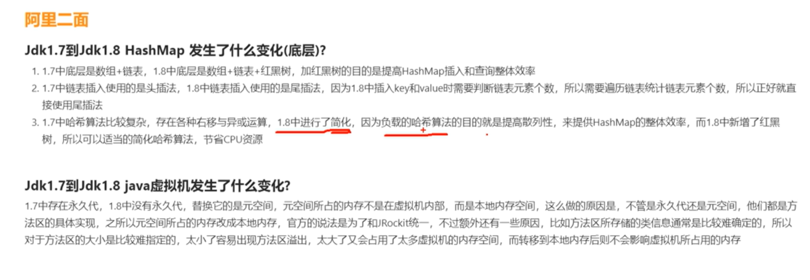
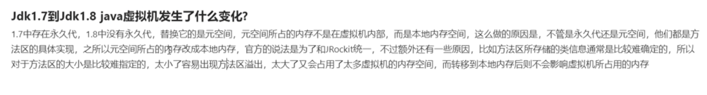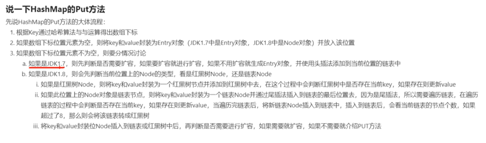

#  19、100万QPS的秒杀系统如何设计限流方案？这样回答才是面试官想要的答案！


# 20、订单30分钟未支付怎么自动取消？如如何设计
### 方案一：RocketMQ / RabbitMQ 延迟消息（⭐ 最推荐）
这是目前大厂处理此类业务最主流、最成熟的方案。利用消息队列自带的延迟投递功能，将“取消订单”作为一个异步事件处理。
- **实现流程：**
    1. 用户创建订单，状态为`UNPAID`。
    2. 订单创建成功后，向MQ发送一条延迟消息（设置延迟级别为30分钟），消息体包含`order_id`。
    3. MQ在30分钟后将消息投递给消费者。
    4. 消费者收到消息后，查询该订单状态。如果仍是`UNPAID`，则执行取消逻辑（更新状态、释放库存等）；如果已支付，则直接丢弃消息。
- **优点：** 削峰填谷，解耦性强，天然支持分布式，消息可靠性高。
- **注意：** 原生RabbitMQ不支持任意时间延迟（需借助插件或死信队列实现），RocketMQ 5.0+ 支持任意精度延迟消息，使用更便捷。

### 方案二：Redis 键过期监听 / Redisson 延迟队列（⭐ 适合中小规模）
利用Redis的内存特性来实现高精度的延迟触发。
- **实现流程：**
    1. 订单创建后，在Redis中设置一个Key（如 `order:timeout:{order_id}`），过期时间设为30分钟，Value可以是订单ID。
    2. 开启Redis的键过期通知（`notify-keyspace-events Ex`），或者使用Redisson框架提供的`RDelayedQueue`。
    3. 监听Key过期事件或从延迟队列中取出任务，执行取消逻辑。
- **优点：** 实现简单，延迟精度高，不依赖重型MQ组件。
- **致命缺点：** Redis过期通知**不可靠**（在高负载或主从切换时可能丢失事件），且不具备消息持久化能力。**生产环境强烈建议使用Redisson的延迟队列（底层基于ZSet和Lua脚本封装），而不是直接用Key过期监听。**

### 方案三：时间轮（Timing Wheel）算法（⭐ 高性能/内存级）

如果你需要处理极高并发（如每秒数万单创建），且希望将延迟任务完全放在应用内存中处理，时间轮是最佳选择。
- **实现流程：**
    1. 使用Netty的`HashedWheelTimer`或自己实现一个分层时间轮。
    2. 订单创建时，将取消任务丢入时间轮，指定30分钟后执行。
    3. 时间轮指针转动到对应槽位时，触发回调函数检查并取消订单。
- **优点：** 极高性能，无网络IO开销。
- **缺点：** 任务存储在JVM内存中，**服务重启会导致任务丢失**。通常需要配合数据库持久化，重启时从DB加载未过期的任务重新放入时间轮，增加了复杂度。
### 方案四：数据库轮询 / 分布式任务调度（保底方案）
当上述中间件不可用时，作为兜底方案。
- **实现流程：**
    1. 使用XXL-JOB、ElasticJob等分布式调度框架。
    2. 每隔1分钟（或更短）扫描一次数据库/索引中`create_time < now - 30min`且状态为`UNPAID`的订单。
    3. 批量执行取消逻辑。
- **优点：** 架构简单，无额外中间件依赖，绝对可靠（最终一定会被扫到）。
- **缺点：** 实时性差（最多延迟一个扫描周期），对数据库IO压力大。
### 💡 核心设计细节与避坑指南
无论选择哪种方案，以下业务逻辑和架构细节是必须考虑的：
**1. 幂等性设计（最重要）**  
取消订单的消息可能会因为网络抖动被重复投递。消费者必须保证**幂等性**：
- 使用数据库乐观锁：`UPDATE orders SET status = 'CANCELLED' WHERE id = ? AND status = 'UNPAID'`。
- 如果更新行数为0，说明订单已被支付或已取消，直接返回成功即可。
**2. 库存回滚的可靠性**  
取消订单通常伴随着库存回滚。如果取消成功但库存回滚失败，会导致超卖或数据不一致。
- **建议：** 将“更新订单状态”和“回滚库存”放在同一个本地事务中；如果涉及跨服务（如订单服务和库存服务），需引入**本地消息表**或**Saga/TCC分布式事务**来保证最终一致性。
**3. 支付回调的竞态条件**  
极端情况下，用户在第29分59秒支付，而取消任务在第30分00秒触发。
- **解决：** 取消任务执行前，**必须**再次查询数据库或调用支付接口确认最新状态。永远不要相信内存中的状态或30分钟前创建订单时的状态。
**4. 兜底机制**  
即使使用了MQ或Redis，也建议保留一个低频的数据库轮询任务（如每小时扫一次）。作为最后的防线，防止因中间件Bug或人为误操作导致的订单永远无法取消。

# 21.RocketMQ消息堆积如何处理
### 1.增加消费者线程数量 consumer.SetConsumeThreadMax(30)
### 2.异步处理消息，比如使用线程池
### 3.调整消费者消费模式，将顺序消费改为并行消费
### 4.使用过滤消费 tag
### 5.临时扩容


#  22.你的线程池核心线程数设多少？面试官问到该如何回答？
### 先明确类型，是CPU密集型，还是IO密集型
**CPU密集型：复杂计算，加密解密，视频编码，这类比较吃CPU,线程太多会频繁的上下文切换，反而影响效率；核心线程数设置为CPU核心数+1，是为了防止某个线程阻塞的时候CPU不空闲**。
**IO密集型；数据库的读写，接口调用啊，文件操作，线程大部分时间再等IO的一个响应，这个CPU的利用效率就比较低。所以核心线程数为2N**
要结合业务场景和真实项目中的，比如，订单系统全是数据库操作，属于IO密集型，先按公式2N,上线后监控，队列的长度，活跃线程数，CPU利用率，队列如果用积压，说明线程数不够，就可以调大，如果CPU利用率低，但是线程很多说明线程冗余，就可以调小

# 23.大文件上传与断点续传一知半解?核心原理一次讲透!
### 1、前端分片
H5自带Blob原生切片，可以切成5M左右的小文件，在给每个小分片排好序，必须计算整个文件的MD5值
### 2、极速秒传
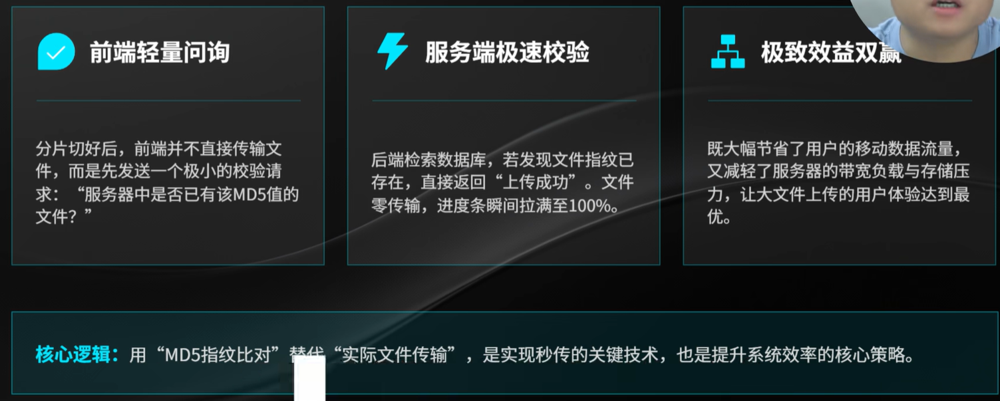

### 3、断点续传

### 4、合并校验

# 24、说说项目中的难点亮点是什么？
三高场景：高并发、高可用、高性能，比如秒杀系统
大数据量场景：分库分表、消息堆积，大文件
数据一致性场景：库存扣减怎么保证不超卖，接口怎么保证幂等性


# 25、接口怎么保证幂等性
1、使用乐观锁，加版本号，局限无法处理插入操作
2、唯一索引，如订单号
3、防重表
4，状态机

5、分布式锁
6、Token令牌
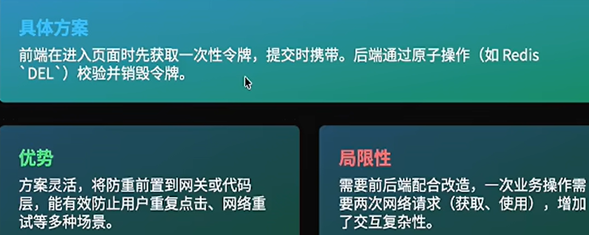
# 26、反问面试官
问题1：入职后会遇到哪些技术/业务挑战？
问题2：完成岗位目标可获得哪些技术资源支持？
问题3：若未通过，我技术/项目最大短板是什么？
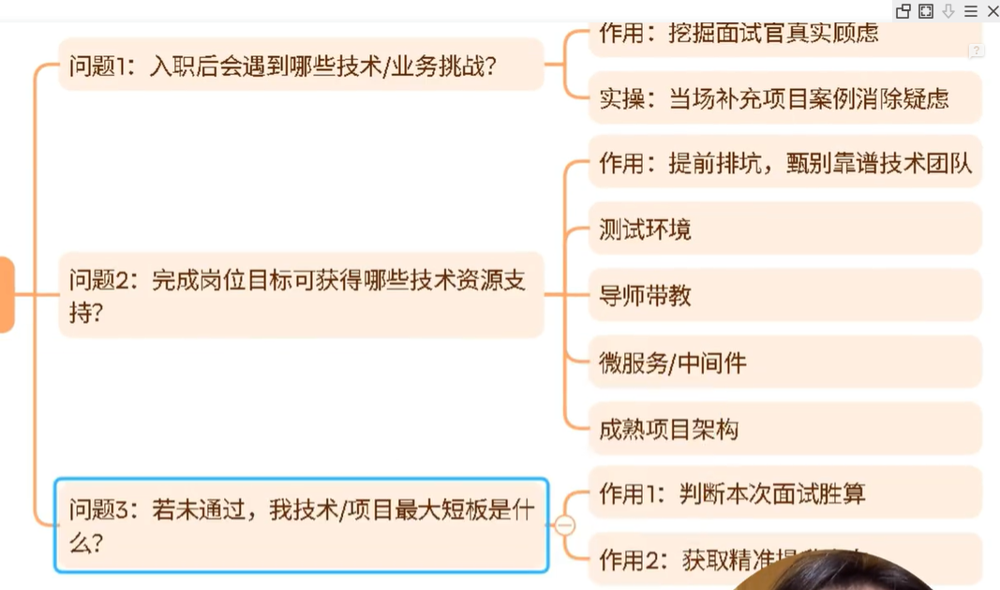

# 27、密码存储
用慢hash存储 像Bcrypt 、Argon2、PBKDF2，随机盐

# 28、RocketMQ如何保证消息不丢失
### 生产者，要确认发送
使用同步发送并处理发送结果，利用客户端的重试机制。
对于需要和本地事务一致性的消息，使用事务消息；半消息-》本地事务-》提交回滚-》兜底回查
### Broker存储阶段，核心是持久化和高可用
可靠性极高的场景，使用同步刷盘，确保消息落盘后响应生产者。生成环境必须主从架构，采用同步复制，保证消息有副本后，才确认成功。一般采用异步刷盘和同步复制，
### 消费者，核心是成功处理后再确认
消费成功后，手动确认，同时要保证消息的幂等。多住多从 ，和监控体系
# 29、Java怎么实现线程安全？

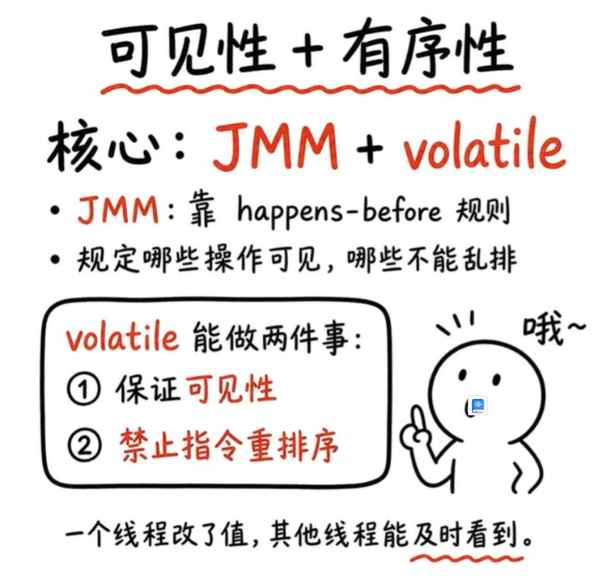

# 30、AQS底层原理
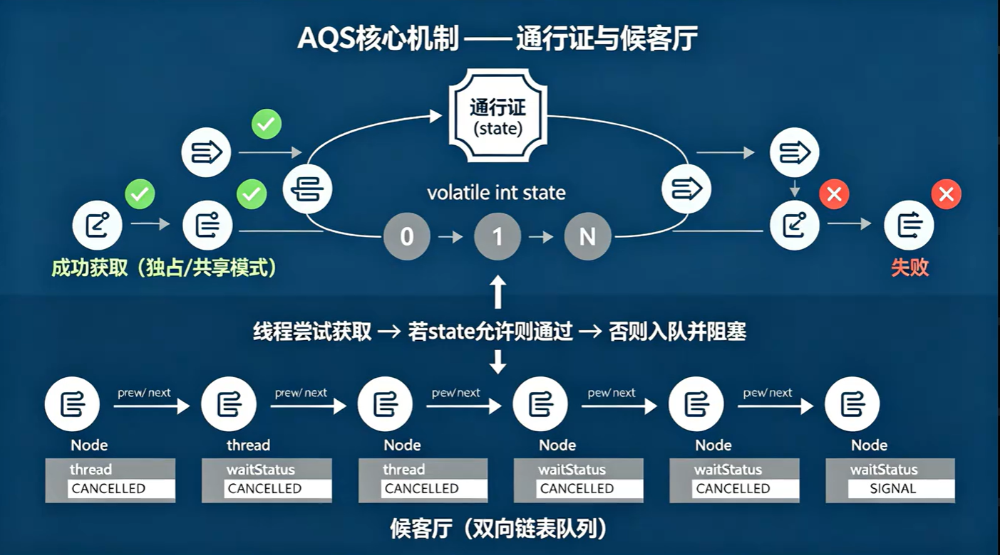
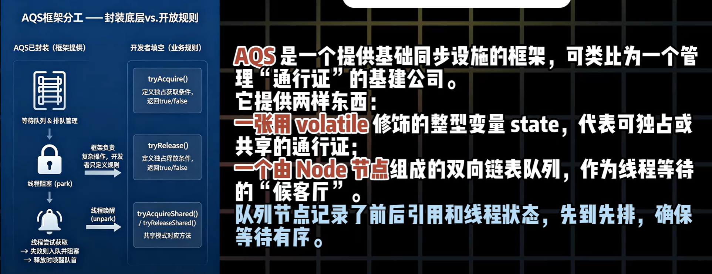
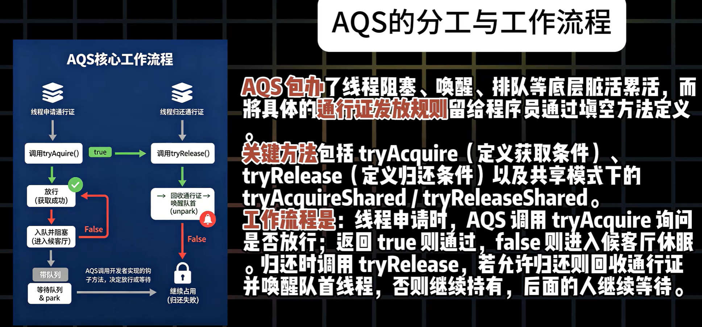
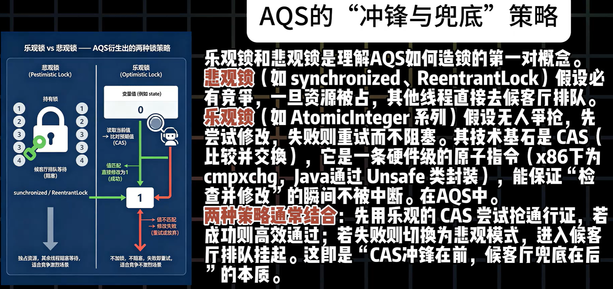
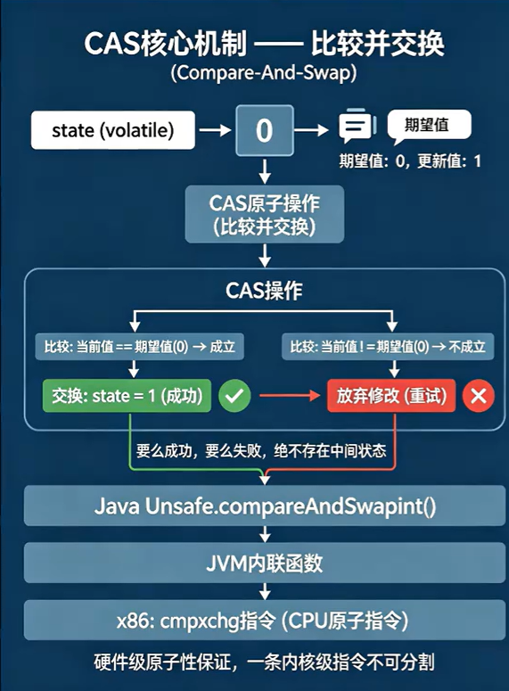

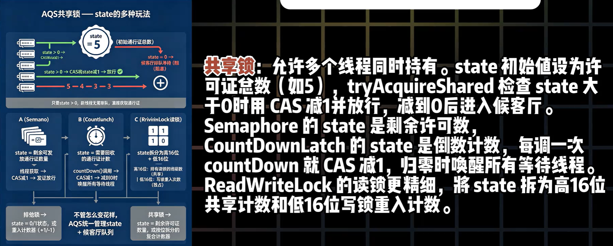
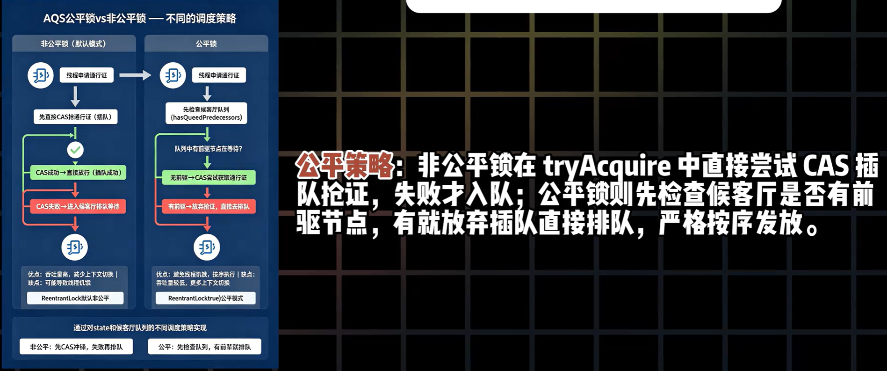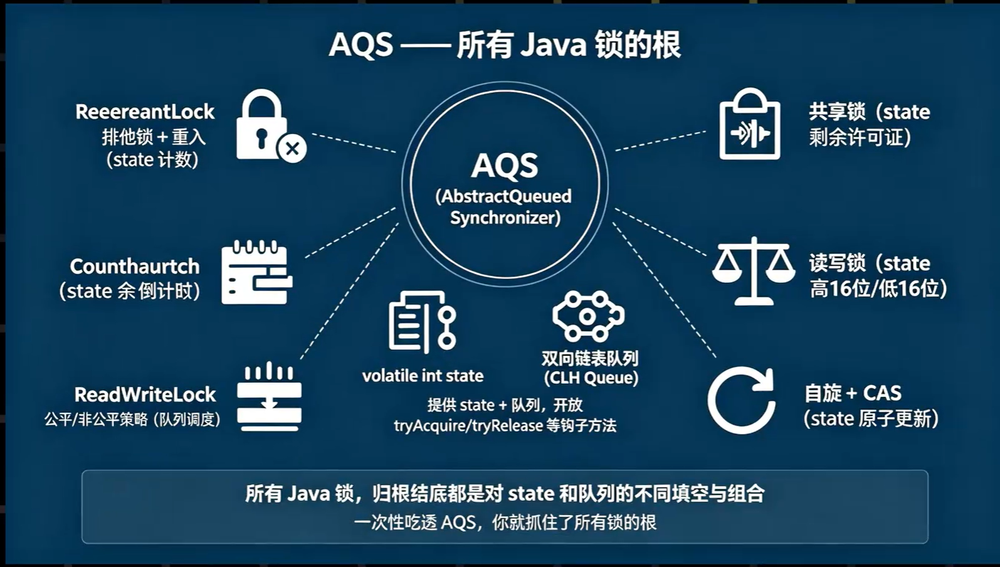
# 31、JVM调优
**堆内存划分**
新生代：Eden区+两个Survivor区(S0、S1),默认比例8:1:1
老年代：存放长时间存活的对象
元空间(JDK8+):存储类元数据，替代永久代，使用本地内存
**对象分配流程**：
1.新对象优先分配在Eden区
2.Eden区满时触发Minor GC,存活对象复制到空闲Survivor区，年龄+1
3.对象年龄达到-XX:MaxTenuringThreshold(默认15)，晋升老年代
4.大对象（如长数组）直接进入老年代，阈值由-X:PretenureSizeThresholdi设置
动态年龄判断：
Survivor区中相同年龄的所有对象大小总和>Survivor区空间的一半，则大于等于该年龄的对象直接晋升老年代，无需等到15岁。
空间分配担保：
Minor GC前，检查老年代连续可用空间是否大于新生代所有对象总空间。若不满足，检查老年代空间是否大于历次晋升的平均大小，否则改为Full GC。
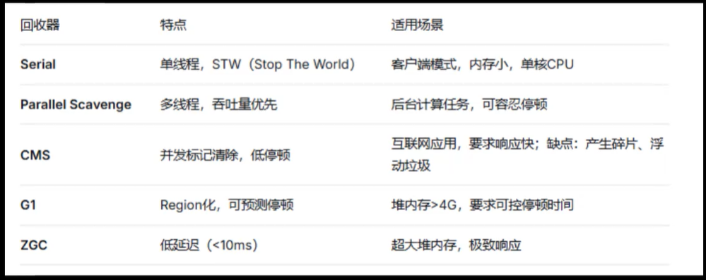
CMS工作阶段：初始标记(STW)→并发标记→重新标记(STW)→并发清除--并发重置。
浮动垃圾指并发清除时新产生的垃圾，本次GC无法处理，需要下次GC。
G1特点：将堆分成多个Region(每个1-32MB),优先回收垃圾最多的Region
(Garbage First)。可以设置目标停顿时间（如200ms),通过统计选择Region数量。
**常用JVM参数**
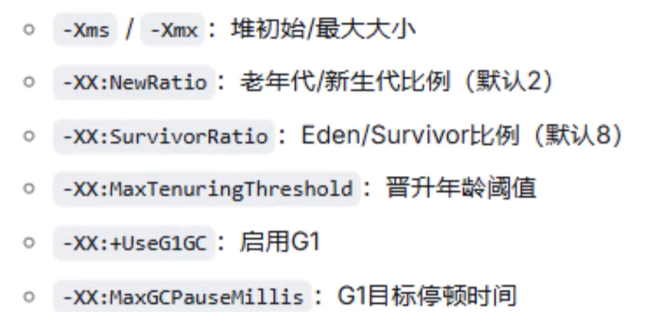
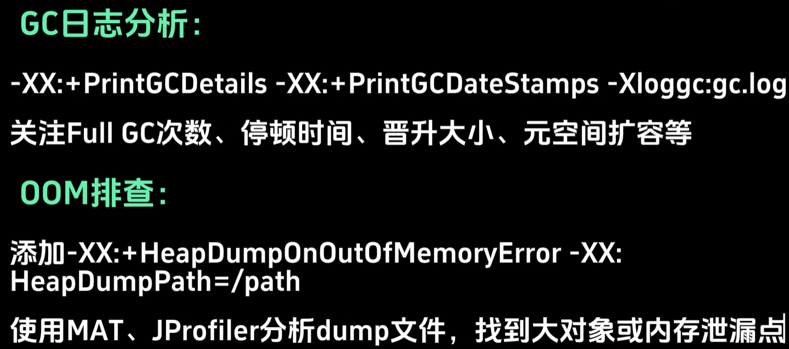
GC调优目标：减少Full GC次数，控制Minor GC停顿时间
常见问题：
**频繁FuGC→可能内存泄漏或老年代分配过快，检查大对象、缓存、连接池**
**GC停顿过长→调整GC器（如G1)，或优化对象分配速率**
**元空间持续增长→可能类加载器泄漏（如热部署场景）**
**无锁设计与GC:使用对象池、栈上分配（逃逸分析）、TLAB(线程本地分配缓冲区)减少GC压力**

# 32、JVM调休常用参数
### 1. `jps` —— 查看Java进程
最基础的指令，先找到你要调优的进程ID（PID）。
```
# 查看所有Java进程，带完整包名
jps -l

# 输出示例：
# 12345 com.example.order.OrderApplication
# 67890 org.apache.catalina.startup.Bootstrap
```
### 2. `jstat` —— 查看GC和类加载统计（最常用）
实时查看堆内存使用、GC次数和耗时，是判断是否需要调优的第一手依据。
```java
# 查看GC情况，每1000ms输出一次，共输出5次
jstat -gc <pid> 1000 5

# 输出字段说明：
# S0C/S1C: Survivor0/1区容量  |  S0U/S1U: 已使用量
# EC/EU: Eden区容量/使用量    |  OC/OU: Old区容量/使用量
# MC/MU: Metaspace容量/使用量  |  YGC/YGCT: Young GC次数/总耗时
# FGC/FGCT: Full GC次数/总耗时 |  GCT: 总GC耗时

# 其他常用参数：
jstat -gcutil <pid>    # 查看各区域使用百分比（更直观）
jstat -gccapacity <pid> # 查看各区域容量
```
- `FGC` 频繁（比如几分钟一次）且 `FGCT` 持续增长 → 需要调优。
- `YGC` 耗时过长（单次超过100ms）→ 调整年轻代大小。
- `S0U/S1U` 长期为0 → Survivor区可能过大或对象直接晋升老年代。
### 3. `jmap` —— 查看堆内存快照（排查内存泄漏）
导出堆转储文件（Heap Dump），用MAT/JProfiler等工具分析大对象。
```java
# 查看堆内存概览（各区域使用情况）
jmap -heap <pid>
# 导出堆转储文件（.hprof），用于离线分析
jmap -dump:live,format=b,file=/path/to/heap.hprof <pid>
# 查看存活对象统计（排查哪些对象占内存多）
jmap -histo:live <pid> | head -20
```
**注意**：`-dump:live` 会触发一次Full GC，生产环境慎用，建议在低峰期执行。
### 4. `jstack` —— 查看线程堆栈（排查死锁/CPU飙高）
输出所有线程的调用栈，用来定位死锁、线程阻塞、CPU占用过高的问题。
```java
# 查看线程堆栈
jstack <pid>
# 输出到文件，便于分析
jstack <pid> > /path/to/thread_dump.log
# 排查死锁（会自动检测并提示）
jstack -l <pid>
```
**实战场景**：CPU飙高时，用 `top -H -p <pid>` 找到CPU最高的线程ID（转成十六进制），再到 `jstack` 输出中查找该线程的堆栈。
### 5. `jinfo` —— 查看/修改JVM参数
查看当前运行的JVM参数配置，也可以动态修改部分参数（需权限）。
```java
# 查看所有JVM参数
jinfo -flags <pid>
# 查看指定参数的值
jinfo -flag MaxHeapSize <pid>
# 动态修改（部分参数支持）
jinfo -flag +PrintGCDetails <pid>
```
### 6. 常用JVM启动参数（调优时调整）
|参数|说明|推荐值|
|---|---|---|
|`-Xms`|初始堆大小|与 `-Xmx` 一致，避免动态扩容开销|
|`-Xmx`|最大堆大小|物理内存的 50%~70%（容器环境需留余地）|
|`-Xmn`|年轻代大小|堆大小的 1/3 ~ 1/4|
|`-XX:SurvivorRatio`|Eden:Survivor比例|默认8:1:1，可调整为6:1:1减少对象晋升|
|`-XX:MaxTenuringThreshold`|对象晋升老年代年龄阈值|默认15，调大（如20）让对象在年轻代多待一会儿|
|`-XX:+UseG1GC`|使用G1垃圾收集器|**JDK9+默认**，适合大堆内存（>4G）|
|`-XX:+UseConcMarkSweepGC`|使用CMS收集器|JDK8常用，但已废弃，建议迁移到G1|
|`-XX:MetaspaceSize`|Metaspace初始大小|避免频繁扩容，建议 256m ~ 512m|
|`-XX:+PrintGCDetails`|打印GC详情|配合 `-Xloggc` 输出到文件|
|`-Xloggc:/path/to/gc.log`|GC日志路径|便于事后分析|
### 7. 实战配置示例（4C8G机器，Spring Boot应用）
```java
java -Xms4g -Xmx4g \
     -Xmn1.5g \
     -XX:MetaspaceSize=256m \
     -XX:MaxMetaspaceSize=512m \
     -XX:+UseG1GC \
     -XX:MaxGCPauseMillis=100 \
     -XX:G1HeapRegionSize=16m \
     -XX:+PrintGCDetails \
     -Xloggc:/app/logs/gc.log \
     -XX:+HeapDumpOnOutOfMemoryError \
     -XX:HeapDumpPath=/app/logs/ \
     -jar app.jar
```
